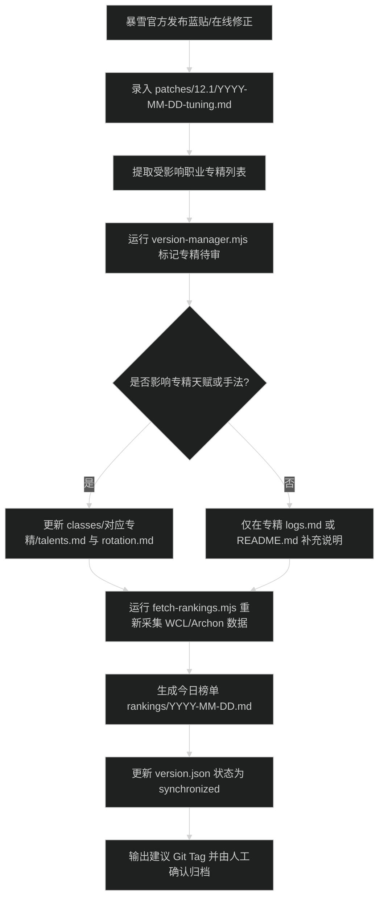

# 知识库版本与蓝贴时效管理规范

本知识库以魔兽世界官方客户端版本与暴雪蓝贴（Blue Posts）生效周期为唯一基准进行版本标记与数据时效同步。

当前基准版本：**12.1.0**（Midnight Season 1）
当前生效在线修正：**2026-09-14-tuning**

---

## 1. 版本命名规则

知识库采用双轨制版本体系：通过根目录 `version.json` 记录当前元数据，通过 Git Tag 归档版本快照。

版本标识遵循魔兽世界发布节奏，划分为三级：

1. **主版本补丁（Major Content Patch）**
   - 标识格式：`vX.Y.0`（例如 `v12.1.0`）
   - 对应事件：新资料片上线或主要内容补丁（团本首开放、大秘境新赛季开启、系统机制全局重做）。
   - 影响范围：全职业专精指南（`classes/`）全量校验、重置天梯榜单周期。

2. **次版本补丁（Minor Patch）**
   - 标识格式：`vX.Y.5` 或 `vX.Y.7`（例如 `v12.1.5`）
   - 对应事件：赛季中期平衡补丁、小团本或重做专精上线。
   - 影响范围：归档于 `patches/12.1.5/`，核验重做专精的技能机制、天赋与配装。

3. **周常维护与在线修正（Hotfixes / Tuning）**
   - 标识格式：`vX.Y.Z-hotfix-YYYYMMDD`（例如 `v12.1.0-hotfix-20260914`）
   - 对应事件：每周服务器例行维护带来的职业数值平衡调整、团本/大秘境机制在线削弱。
   - 影响范围：录入 `patches/12.1/{YYYY-MM-DD}-tuning.md`，更新受影响专精状态，刷新天梯榜单（`rankings/`）。

---

## 2. 蓝贴时效驱动机制

暴雪发布蓝贴后，数据同步按照以下时序处理：



---

## 3. 元数据结构说明（version.json）

根目录下的 `version.json` 为机器与自动化脚本读取的唯一真实源，字段定义如下：

- `gameVersion`（string）：魔兽世界客户端主版本号，如 `12.1.0`。
- `expansion`（string）：资料片英文名称，如 `Midnight`。
- `season`（string）：当前所属赛季，如 `Midnight Season 1`。
- `activeHotfix`（object）：当前生效的蓝贴信息。
  - `date`（string）：热修生效日期（ISO 格式 `YYYY-MM-DD`）。
  - `title`（string）：热修分析文档标题。
  - `path`（string）：对应热修文件相对路径。
  - `affectedSpecs`（array）：受数值或机制改动影响的专精列表（格式 `class/spec`）。
- `dataSync`（object）：外部数据源同步状态。
  - `lastSyncAt`（string）：最后一次抓取榜单的 UTC 时间戳。
  - `rankingsDate`（string）：当前生效榜单的日期。
  - `status`（string）：状态值，`synchronized`（已同步）、`pending-fetch`（待抓取）或 `needs-review`（待核验）。
- `gitTag`（string）：当前版本建议对应的 Git Tag 名称。
- `specStatus`（object）：各专精的手法与配装时效状态。
  - `verifiedAt`（string）：最近一次人工/脚本验证通过日期。
  - `status`（string）：`up-to-date`（最新）或 `needs-review`（受蓝贴影响待更新）。
  - `hotfixAligned`（string）：已对齐的热修日期。

---

## 4. 命令行管理工具

自动化版本管理脚本位于 `automation/scripts/version-manager.mjs`。

### 检查当前时效对齐状态
```bash
node automation/scripts/version-manager.mjs check
```
输出当前游戏版本、生效热修、各专精对齐状态，以及天梯榜单是否与当前热修日期一致。

### 接入新蓝贴热修
当在 `patches/12.1/` 录入新的在线修正文档后，运行：
```bash
node automation/scripts/version-manager.mjs record-hotfix patches/12.1/2026-09-14-tuning.md
```
脚本将自动提取文档中的受影响专精，更新 `version.json` 并将相关专精标记为 `needs-review`。

### 标记专精已完成更新
当修改完专精的手法和配装文档后，运行：
```bash
node automation/scripts/version-manager.mjs mark-synced death-knight/unholy
```

### 查看建议的 Git Tag 命令
```bash
node automation/scripts/version-manager.mjs tag-info
```
输出符合命名规范的 `git tag` 命令，供核对后由人工确认执行。

---

## 5. 易错边界与排查

1. **版本目录不一致**：
   `version.json` 中的 `gameVersion` 主次版本必须与 `patches/{gameVersion}/` 目录名保持一致（例如 `12.1.0` 对应 `patches/12.1/`）。
2. **专精名拼写**：
   受影响专精标识必须采用 `class/spec` 格式，与 `classes/` 下的英文目录结构严格匹配（例如 `death-knight/unholy`，不得写为 `dk/unholy` 或中文名）。
3. **榜单时效滞后**：
   若暴雪热修于周二上线，但 WCL 数据尚未更新，应将 `dataSync.status` 设为 `pending-fetch`，并在对应榜单顶部注明数据生效延迟说明，待周末榜单样本充分后再运行爬虫重采。
