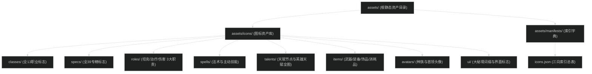

# 静态资源与魔兽世界图标资产索引指南

本目录统一归档魔兽世界（World of Warcraft）全职业、专精、技能、天赋、装备饰品与界面的静态资源，基于 WebP 压缩格式实现完全离线化存储，并配套结构化索引字典。

---

## 1. 架构拓扑与目录组织

静态资源由统一入口、八大功能分类与三向索引清单构成：



### 物理目录划分规范

| 目录路径 | 归档对象 | 命名规范 | 典型文件示例 |
| :--- | :--- | :--- | :--- |
| `assets/icons/classes/` | 全 13 个职业标志 | 官方标识与英文小写别名双轨 | `death-knight.webp`, `classicon_paladin.webp` |
| `assets/icons/specs/` | 全 39 个专精标志 | `{class}-{spec}.webp` | `death-knight-blood.webp`, `mage-fire.webp` |
| `assets/icons/roles/` | 3 大团队职责 | `{role}.webp` | `tank.webp`, `healer.webp`, `dps.webp` |
| `assets/icons/spells/` | 职业与通用法术、技能 | 暴雪官方小写蛇形标识符 | `spell_deathknight_deathstrike.webp` |
| `assets/icons/talents/` | 天赋专属节点与成就 | 暴雪官方标识符 | `achievement_boss_kelthuzad_01.webp` |
| `assets/icons/talents/hero/` | 英雄天赋全幅艺术背景底图 | `hero_{heroId}.webp` | `hero_31.webp`, `hero_32.webp` |
| `assets/icons/items/` | 武器、护甲、饰品、消耗品 | 官方物品标识符 (`inv_...`, `inv12_...`) | `inv_shield_06.webp`, `inv_banner_03.webp` |
| `assets/icons/avatars/` | 种族特质头像与首领原画 | 官方种族/NPC标识符 | `racial_dwarf_findtreasure.webp` |
| `assets/icons/ui/` | 大秘境钥匙、词缀与段位 | 官方界面标识符 (`ui_...`, `affix_...`) | `expansionicon_midnight.webp` |
| `assets/manifests/` | 机器可读权威元数据索引表 | 结构化 JSON 清单 | `icons.json` |

---

## 2. 图标命名设计与规范

本仓库采用“官方原生标识符存储 + 语义别名快速调用 + JSON 权威三向索引”的三位一体设计。

### 2.1 物理文件命名原则
1. **统一小写蛇形命名（Snake Case）**：所有图标物理文件名严格采用纯小写字母、下划线及数字（例如 `spell_nature_healingtouch.webp`），杜绝大小写混合导致在不同操作系统（Linux / macOS / Windows）间发生路径大小写敏感错误。
2. **完全对齐暴雪客户端**：直接采用魔兽客户端内部 `Interface/ICONS/{icon_name}.blp` 的原生导出标识符，确保与 WCL、Archon、SimC、Wowhead 等权威生态 1:1 无缝映射。
3. **高频业务语义别名**：
   - 职业图标保留 `classes/{class}.webp`（如 `paladin.webp`）作为前端直引别名；
   - 专精图标保留 `specs/{class}-{spec}.webp`（如 `paladin-holy.webp`）；
   - 职责图标保留 `roles/{role}.webp`（`tank.webp`、`healer.webp`、`dps.webp`）。

---

## 3. 权威数据源白名单与 CDN 规则

本仓库所有图标资源采集严格限定在以下经校验的权威数据通道，严禁从无公信力第三方图床抓取：

| 数据源机构 | 权威 CDN URL 模板 | 用途范围 | 格式与规格 |
| :--- | :--- | :--- | :--- |
| **Wowhead (Zamimg)** | `https://wow.zamimg.com/images/wow/icons/large/{iconName}.jpg` | 全量技能、物品、天赋、UI（主力源） | 56x56 像素无损源图 |
| **暴雪官方 Render API** | `https://render.worldofwarcraft.com/us/icons/56/{iconName}.jpg` | 官方原生图标（自动容灾兜底源） | 56x56 像素 JPG 原图 |
| **RPGLogs / Warcraft Logs** | `https://assets.rpglogs.com/img/warcraft/talents/hero/{heroId}_full.png` | 英雄天赋树全幅背景艺术底图 | 256x256+ PNG 透明高保真大图 |
| **Wago Tools (CASC)** | `https://wago.tools/db2/ChrSpecialization` | 官方 FileDataID 与 ChrSpecialization 映射表 | 结构化 DB2 解包字典 |

---

## 4. 三向索引字典指南 (icons.json)

索引清单文件位于 `assets/manifests/icons.json`，为 Web 与 App 提供 O(1) 复杂度的双向反查能力。

### 4.1 实体结构定义

```typescript
export interface WowIconManifest {
  version: string;
  gameVersion: string;
  generatedAt: string;
  totalIcons: number;
  entities: {
    classes: Array<{
      slug: string;          // 职业规范代号，如 "death-knight"
      nameCn: string;        // 官方简中名，如 "死亡骑士"
      officialIcon: string;  // 官方原始图标标识符，如 "classicon_deathknight"
      path: string;          // 本地快速访问路径，如 "icons/classes/death-knight.webp"
      officialPath: string;  // 官方命名路径，如 "icons/classes/classicon_deathknight.webp"
    }>;
    specs: Array<{
      specId: number;        // 暴雪官方 ChrSpecialization ID，如 250
      slug: string;          // 专精代号，如 "blood"
      nameCn: string;        // 专精简中名，如 "鲜血"
      classSlug: string;     // 所属职业，如 "death-knight"
      role: 'tank' | 'healer' | 'dps';
      officialIcon: string;  // 对应法术图标标识符，如 "spell_deathknight_bloodpresence"
      path: string;          // 本地快速访问路径，如 "icons/specs/death-knight-blood.webp"
      sourcePath: string;    // 源法术路径，如 "icons/spells/spell_deathknight_bloodpresence.webp"
    }>;
    roles: Array<{
      slug: string;          // "tank" | "healer" | "dps"
      nameCn: string;        // "坦克" | "治疗" | "伤害输出"
      officialIcon: string;  // 如 "inv_shield_06"
      path: string;          // 如 "icons/roles/tank.webp"
    }>;
  };
  icons: Array<{
    id: string;              // 官方原生标识符，如 "spell_deathknight_deathstrike"
    filename: string;        // 文件名，如 "spell_deathknight_deathstrike.webp"
    path: string;            // 本地物理路径，如 "icons/spells/spell_deathknight_deathstrike.webp"
    category: string;        // 归属类别："spells" | "talents" | "items" | "classes" | "avatars" | "ui"
    subCategory: string | null;
    nameCn: string;          // 暴雪官方国服客户端中文译名
    nameEn: string;          // 英文原名
    spellIds: number[];      // 关联的 Spell ID 数组，如 [49998, 221536]
    cdnFallbackUrl: string;  // 权威在线 CDN 容灾 URL
  }>;
}
```

---

## 5. 自动化同步与维护 SOP

当游戏推出新版本补丁、新增职业专精或引入新物品饰品时，通过内置脚本一键全量更新：

### 5.1 执行完整增量同步
```bash
node automation/scripts/sync-icons.mjs
```
- **执行逻辑**：
  1. 扫描 `automation/data/talent-blueprints/*.json` 全职业底图提取所有天赋图标与英雄大图；
  2. 结合 `automation/data/spell-translations.json` 挂载官方简中译名与 Spell ID；
  3. 检测本地文件，跳过已存在的有效 WebP 文件；
  4. 并发向 Wowhead Zamimg 与暴雪官方 Render CDN 拉取缺失图标；
  5. 调用本地 `cwebp` 进行高质量 WebP 编码压缩；
  6. 自动补全职业与专精语义别名映射；
  7. 重新编译并输出 `assets/manifests/icons.json`。

### 5.2 调试与限额运行
```bash
# 仅拉取前 20 张图标用于调试
node automation/scripts/sync-icons.mjs --limit=20

# 仅预检扫描统计，不执行实际网络下载与本地写盘
node automation/scripts/sync-icons.mjs --dry-run
```

---

## 6. 跨端消费与代码集成示例

### 6.1 前端 React / Next.js 组件直接消费
```tsx
import Image from 'next/image';
import iconsManifest from '@/assets/manifests/icons.json';

interface SpellIconProps {
  spellId?: number;
  iconName?: string;
  size?: number;
  className?: string;
}

export function WowSpellIcon({ spellId, iconName, size = 36, className }: SpellIconProps) {
  // 1. 优先根据 spellId 精确索引
  let target = iconsManifest.icons.find(i => spellId && i.spellIds.includes(spellId));

  // 2. 次选根据图标标识符索引
  if (!target && iconName) {
    target = iconsManifest.icons.find(i => i.id === iconName.toLowerCase());
  }

  // 3. 物理路径或 CDN 回退
  const src = target ? `/${target.path}` : target?.cdnFallbackUrl || '/assets/icons/spells/inv_misc_questionmark.webp';
  const alt = target?.nameCn || target?.nameEn || 'Spell Icon';

  return (
    <Image
      src={src}
      alt={alt}
      width={size}
      height={size}
      className={`rounded border border-[#333] ${className || ''}`}
      unoptimized
    />
  );
}
```

### 6.2 专精与职业直选
```ts
// 获取全职业列表
const classes = iconsManifest.entities.classes;
// 获取死骑坦克图标路径
const bdkSpec = iconsManifest.entities.specs.find(s => s.classSlug === 'death-knight' && s.slug === 'blood');
const bdkIconPath = bdkSpec?.path; // "icons/specs/death-knight-blood.webp"
```

---

## 7. 常见问题排查（FAQ）

1. **问：新增了装备饰品，如何快速加入图标库？**
   答：在专精手册中记录官方物品 ID 或在 `spell-translations.json` 中配置该物品技能，直接执行 `node automation/scripts/sync-icons.mjs`，脚本会自动识别新增项并下载落盘。
2. **问：为什么部分天赋图标归类在 `items/` 目录下？**
   答：暴雪设计团队在许多天赋节点中复用了经典装备与武器图标（前缀以 `inv_` 开头）。本系统按照“单图单存、逻辑关联”原则，物理文件归入 `items/`，通过 `manifests/icons.json` 的 `spellIds` 实现双向检索，避免产生多份冗余副本。
3. **问：如果本地未安装 `cwebp` 如何处理？**
   答：macOS 环境下运行 `brew install webp` 即可获得官方二进制工具；脚本亦支持在无 `cwebp` 环境下回退处理。
