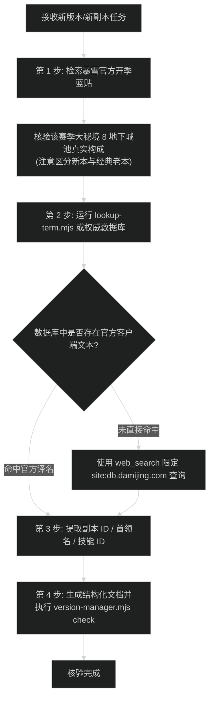

# 魔兽世界国服官方术语检索与赛季轮换核验 SOP

本文档供后续参与本仓库维护的 AI Agent 强制遵守。任何涉及新版本、新赛季、地下城副本、团队副本、首领技能与装备道具的文本录入与翻译，必须严格按本方案执行核验，严禁使用大模型进行直译或主观臆测。

---

## 1. 核心铁律 (Non-Negotiable Rules)

1. **零直译 / 零机翻原则**：
   - 魔兽世界拥有由暴雪中国本地化团队维护的官方名词体系。英文名称在不同语境下具有专属的官方翻译，字面直译极易出错。
   - **典型反例**：
     - `The Blinding Vale`：字面直译为“失明谷”或“盲目溪谷”；在至暗之夜圣光圣地语境下，国服客户端官方译名确认为**夺目谷**（副本 ID: 1309）。
     - `Murder Row`：字面直译为“谋杀小径”；银月城官方区域地图译名确认为**密谋小径**（副本 ID: 1304）。
     - `The Venomous Abyss`：字面直译为“深毒深渊”或“剧毒深渊”；国服官方团队副本全称确认为**烈毒之渊**（副本 ID: 1320）。
     - `Den of Nalorakk`：字面直译为“纳洛拉克之穴”或“巢穴”；国服官方客户端全称为**纳洛拉克的洞穴**（副本 ID: 1311）。
     - `Voidscar Arena`：字面直译为“虚空竞技场”；国服官方客户端全称为**虚空之痕竞技场**（副本 ID: 1313）。
2. **赛季轮换池真实性核验原则**：
   - 严禁假设“新资料片包含 8 个新地下城，则当季大秘境即为这 8 个新地下城”。
   - 自巨龙时代（Dragonflight）与至暗之夜（Midnight）以来，暴雪大秘境赛季固定采用“新本地下城 + 往期经典回归地下城”复合轮换机制。例如 Midnight Season 2 官方轮换池为 5 个新地下城加 3 个经典回归地下城（红玉新生法池、诸王之眠、塞塔里斯神庙）。
   - 录入赛季攻略前，必须先查阅官方开季蓝贴确认该赛季确切的 8 本名单。
3. **文本合规性原则**：
   - 全文严禁出现任何 emoji；
   - 严禁互联网管理黑话；
   - 纯事实驱动，必须提供准确的副本编号、技能 ID 与数据来源。

---

## 2. 权威检索数据源梯队

执行文案与数据核对时，必须按以下优先级从权威数据源提取：

### 第一梯队：国服客户端镜像与官方数据库（唯一真实源）
- **大米网正式服数据库**：`https://db.damijing.com/`
  - 该站点直接解析国服客户端提取数据，包含副本编号、全首领中文名、技能 ID 与地图背景文本。
  - 查询范式：`https://db.damijing.com/instance/{instance_id}`
- **网易暴雪国服官方数据库**：`https://wow.166.net/`
  - 官方中文物品、副本与法术直查站。
- **魔兽世界国服官方新闻站**：`https://wow.blizzard.cn/`
  - 用于核验大版本与补丁更新说明完整版的简体中文译名。

### 第二梯队：暴雪官方蓝贴与赛季轮换源
- **Wowhead Blue Tracker (官方蓝贴聚合)**：`https://www.wowhead.com/blue-tracker`
  - 用于检索开季蓝贴（如《Midnight Season X is Now Live》），获取“Fresh Dungeon Rotation”列表。
- **Warcraft Logs (WCL)**：`https://www.warcraftlogs.com/`
  - 用于核验 Zone ID（如 Zone 53 烈毒之渊、Zone 55 大秘境）与首领 Encounter ID。

---

## 3. Agent 标准查询与核验操作流 (SOP)

后续 Agent 在录入新内容前，必须依次执行以下 4 步：



### 步骤详解与实操命令：

#### 第 1 步：查验官方赛季大秘境轮换池
运行 `web_search` 或使用 `fetch_content` 读取暴雪官方开季新闻：
```bash
# 搜索官方开季蓝贴中的地下城轮换清单
web_search: "Midnight Season 2" "Fresh Dungeon Rotation" OR "is Now Live"
```
提取“Dungeon Rotation”列表，列出全部 8 个地下城的英文全称，判断哪些是资料片新本、哪些是经典回归本。

#### 第 2 步：检索国服官方客户端简中译名
在终端运行本地查询脚本：
```bash
# 查询单个地下城的官方译名与 ID
node automation/scripts/lookup-term.mjs dungeon "The Blinding Vale"

# 查看当前赛季官方 8 本核对清单
node automation/scripts/lookup-term.mjs list-season-dungeons 12.1
```

若查询词为新公布内容、本地词典未收录，使用以下限定域名的搜索指令：
```bash
# 限定在国服权威数据库中搜索
web_search: site:db.damijing.com/instance "英文原名或关键中文"
web_search: site:wow.blizzard.cn "英文原名或关键中文"
```

#### 第 3 步：三元组交叉验证
确认录入时，必须同时核实以下三元组的一致性：
1. **英文唯一标识 (Slug / English Name)**：如 `the-blinding-vale` / `The Blinding Vale`。
2. **国服客户端官方中文名**：如 `夺目谷`（严禁出现“失明谷”、“盲目溪谷”等机翻词）。
3. **数字编号 (Instance ID / Zone ID / Encounter ID)**：如地下城编号 `1309`、WCL Zone ID `55`。

#### 第 4 步：更新常数并运行系统时效校验
1. 将核实后的映射关系录入 `automation/scripts/instance-constants.mjs`。
2. 将数据基准写入 `automation/data/dungeon-benchmarks.json` 与 `raid-benchmarks.json`。
3. 执行版本与时效管理自检脚本：
   ```bash
   node automation/scripts/version-manager.mjs check
   ```

---

## 4. 常见错误对照速查表 (Bad vs Good)

| 英文原名 | 常见错误翻译 (严禁使用) | 国服官方客户端正确译名 | 错误归因剖析 |
| :--- | :--- | :--- | :--- |
| **The Blinding Vale** | 盲目溪谷、失明谷 | **夺目谷** | 忽视了圣光峡谷闪耀夺目的剧情设定，误取字面贬义词。 |
| **Murder Row** | 谋杀小径 | **密谋小径** | 忽视了银月城盗贼与走私暗语背景，机翻直译。 |
| **Den of Nalorakk** | 纳洛拉克之穴、纳洛拉克巢穴 | **纳洛拉克的洞穴** | 漏掉国服官方特有的结构助词“的”以及地图建筑规范词。 |
| **Voidscar Arena** | 虚空竞技场、虚痕角斗场 | **虚空之痕竞技场** | 缩略了官方本地化的“之痕”虚词。 |
| **Altar of Fangs** | 獠牙祭坛 | **毒牙祭坛** | Fangs 在巨魔蛇毒神庙语境下官方固定译为“毒牙”。 |
| **The Venomous Abyss** | 深毒深渊、剧毒深渊、剧毒之渊 | **烈毒之渊** | 官方史诗团本正式命名采用“烈毒之渊”，非通俗机翻。 |
| **Ula'tek** | 乌拉泰克、乌拉'泰克 | **乌拉特克** | 官方中文音译采用“特克”且不带额外西文隔音号。 |
| **Temple of Sethraliss** | 塞萨利斯神庙 | **塞塔里斯神庙** | Sethraliss 官方标准译名为蛇神“塞塔里斯”。 |

---

## 5. 交付自查清单 (Pre-Flight Checklist)

在修改或新建任何副本与版本文档前，对照本清单逐项检查：
- [ ] 当前赛季大秘境池是否通过官方蓝贴核实（包含老地下城）？
- [ ] 地下城中文名称是否通过 `db.damijing.com` 或 `lookup-term.mjs` 验证？
- [ ] 首领中文名称是否与游戏内“地下城手册”一致？
- [ ] 全文是否已消除任何 emoji 符号？
- [ ] Mermaid 代码块中包含圆括号的节点文本是否已添加标准双引号 `["..."]`？
- [ ] `node automation/scripts/version-manager.mjs check` 输出是否为“全面同步完成”？
