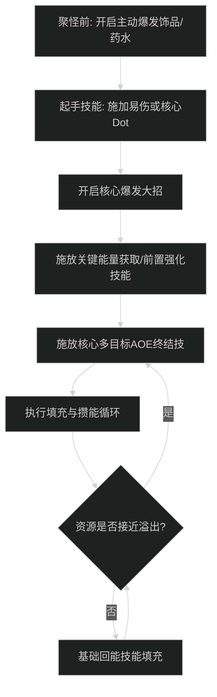
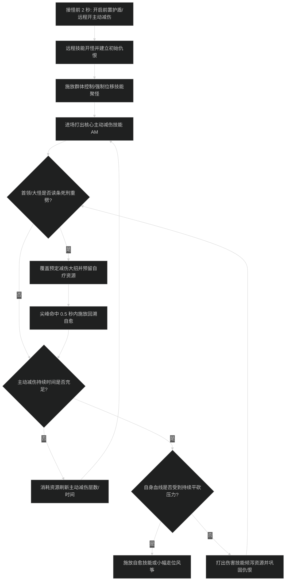
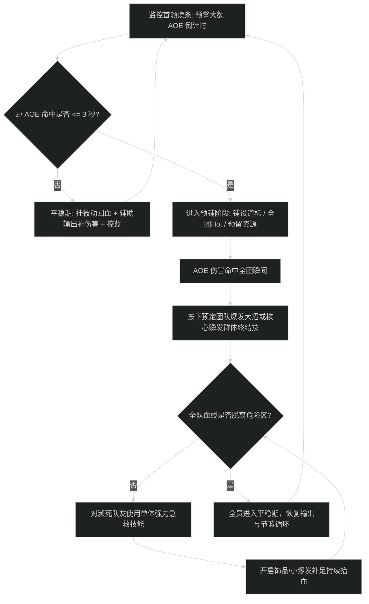

# [专精中文名]施法循环与优先级

## 1. 核心资源循环与原则

- **[核心资源名称]**：
  - 产生途径：[基础技能列表]
  - 消耗途径：[终结技/免伤/救急技能列表]
  - **核心防溢出原则**：[明确资源上限阈值，何时必须强制消耗以防浪费]

---

<!-- 根据职责三选一保留对应章节，并删除其他两类章节与流程图 -->

<!-- ==================== 选项 1：输出专精（DPS）循环 ==================== -->

## 2. 大秘境 AOE 爆发循环（输出专精）

### 阶段一：起手爆发时序
1. 开怪准备：提前 1 秒预留资源或使用爆发饰品/药水。
2. 铺设易伤：对主目标或怪堆施加核心增伤 Debuff / 持续伤害。
3. 开启核心爆发技能，打满高加成窗口。
4. 顺劈倾泻：打出最高收益的 AOE 终结技。

### 阶段二：平稳顺劈循环
1. 优先打出触发的免费/强化技能。
2. 资源达到阈值时立即打出终结技防溢出。
3. 卡 CD 使用核心顺劈充能技能。
4. 基础技能填充回能。

---

## 3. 团本单体输出优先级（输出专精）

---

<!-- ==================== 选项 2：坦克专精（Tank）循环 ==================== -->

## 2. 大秘境聚怪接怪与主动减伤覆盖（坦克专精）

### 阶段一：接怪防秒杀起手 SOP
1. 严禁裸身进怪堆，在接触怪堆前开启前置免伤或预留免伤资源。
2. 使用远程技能建立首波仇恨，通过聚怪技能将散落怪物聚拢在控制区。
3. 接触怪堆首个 GCD 必须打出核心主动减伤（如正义之盾/骨髓分裂/铁鬃）。
4. 开启短 CD 减伤技能覆盖接怪高压期。

### 阶段二：死刑技能（Tank Buster）应对协议
1. 监控首领/大怪重击施法条，在读条结束前开启对应硬减伤。
2. 命中瞬间打出回溯自疗或刷新吸收盾，杜绝被后续平砍补刀。
3. 保持主动减伤 95% 以上覆盖率，严禁在无减伤状态下硬吃物理平砍。

---

<!-- ==================== 选项 3：治疗专精（Healer）循环 ==================== -->

## 2. 小队高压尖峰抬血与预铺时序（治疗专精）

### 阶段一：高压前奏预铺
1. 在大范围 AOE 伤害来临前 3 秒停止低效泄蓝，进入预铺状态。
2. 铺设团队复制机制（如道标/救赎/全员回春/护盾）。
3. 伤害跳出瞬间打出核心群体瞬发终结技，完成首轮血线拉升。

### 阶段二：急救优先级裁决（Triage）与平稳期
1. 优先抢救身上带有点名 Dot 或血线低于 30% 的濒死队友。
2. 血线脱离斩杀线后交由持续回血技能抬满，不盲目过量狂刷。
3. 无掉血压力时，切换至近战/远程输出循环补足伤害并反哺资源。

---

## 4. 新手易犯错误自查（按职责选择自查要点）

<!-- DPS 专精自查 -->
1. **资源打顶溢出**：能量/连击点堆满依然盲目打攒能技能，造成大量伤害浪费。
2. **大招与饰品错位冷却**：未能将主动饰品与爆发核心技能对齐，导致峰值秒伤腰斩。
3. **多目标顺劈技能打错**：面对 3 目标以上仍在使用纯单体终结技。

<!-- Tank 专精自查 -->
1. **裸身接怪猝死**：脱战跑路后减伤断档，未开减伤冲入怪堆被小怪平砍秒杀。
2. **满血滥用回溯自愈**：在满血状态消耗大量能量自愈，真正吃尖峰大掉血时空有资源冷却导致暴毙。
3. **走出核心减伤阵地**：离开奉献/凋零等地面减伤阵地未及时重铺，导致精通与顺劈收益丢失。

<!-- Healer 专精自查 -->
1. **伤害跳出后慢吞吞读条**：缺乏预铺意识，队友濒死才开始慢速读条，导致减员。
2. **全程站桩零输出**：平稳期挂机发呆，未贡献辅助输出与打断控制。
3. **盲目过量治疗导致空蓝**：队友 95% 血线频繁使用高耗蓝技能，导致史诗团本中途空蓝。
