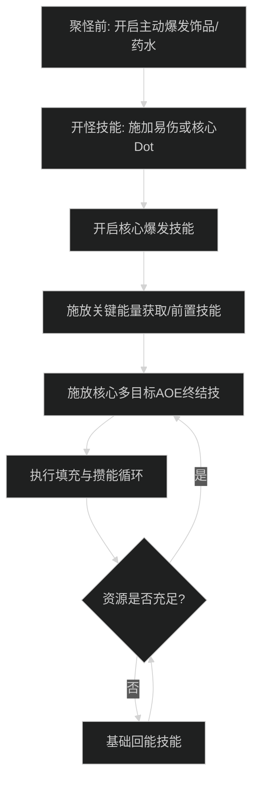

# [专精中文名]输出手法与施法优先级

## 1. 核心资源循环与原则

- **[核心资源名称]**：
  - 产生途径：[技能列表]
  - 消耗途径：[技能列表]
  - **核心防溢出原则**：[明确何时必须泄能、防止资源顶满浪费]
- **目标数量分支**：
  - **单体（1-2目标）**：[主要消耗技能]
  - **多目标（3目标及以上）**：[主要 AOE 顺劈技能]

---

## 2. 大秘境 AOE 爆发循环（[主流英雄天赋] 流派）

### 阶段一：起手爆发时序
1. 开怪前准备：[爆发饰品/药水]。
2. 聚怪铺垫：[前置挂 Dot / 聚怪减伤]。
3. 开启爆发大招：[技能名与效果]。
4. 打入核心高伤 AOE 技能：[技能名与机制]。

### 阶段二：平稳顺劈循环
1. 优先打出触发的免费/强化技能：[技能名]。
2. 资源达到阈值时立即打出核心终结技：[技能名]。
3. 卡冷却使用高伤填充技能：[技能名]。
4. 基础技能填充回能：[技能名]。

---

## 3. 团本单体输出优先级

1. 保持目标身上的核心 Dot / 易伤 Debuff。
2. 爆发大招期与饰品严格对齐。
3. 资源达到阈值时打终结技防溢出。
4. 高伤害充能技能冷却完成即打。
5. 基础产能技能填充空白 GCD。

---

## 4. 新手易犯错误自查

1. **[常见失误 1：如资源溢出]**：
   - 表现：[描述错误操作]
   - 改进动作：[具体应按哪个键解决]
2. **[常见失误 2：如顺劈窗口站位或目标数打错]**：
   - 表现：[描述错误操作]
   - 改进动作：[具体修正动作]
3. **[常见失误 3：如忽略核心团队辅助]**：
   - 表现：[描述错误操作]
   - 改进动作：[具体应在何时施放何种团队技能]
