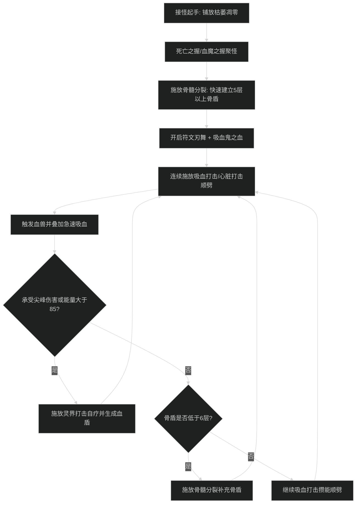
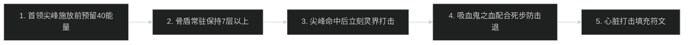

# 鲜血死亡骑士输出手法与施法优先级

## 1. 核心资源循环与原则

- **骨盾层数（Bone Shield）与符文周转**：
  - 骨髓分裂（Marrowrend）：消耗 2 个符文，生成 3 层骨盾。保持骨盾层数常驻在 7-10 层之间，为自身提供高额护甲与急速加成。
  - 心脏打击（Heart Strike）：消耗 1 个符文，产生 15 点符文能量（多目标顺劈下产生更多）。
- **符文能量（Runic Power）与灵界打击**：
  - 灵界打击（Death Strike）：消耗 40 点符文能量，造成伤害并治疗自身（基于过去 5 秒承受伤害百分比，有最低保底值）。
  - **核心防溢出原则**：
    - 能量不过 85 点：符文能量上限一般为 125 点左右，当能量超过 85 点且符文充足时，必须立刻打出灵界打击泄能，防止心脏打击产生的能量溢出。
    - 符文不堆满 6 个：时刻保持至少 3 个符文在恢复中，防止符文恢复时间暂停。
    - 掉血后再灵打：非溢能状态下，不要在满血时浪费灵界打击，应在承受尖峰伤害后的 1-2 秒内打出，以吃满承伤自疗机制。

---

## 2. 大秘境聚怪接怪与 AOE 爆发循环（萨莱茵 San'layn 流派）

### 阶段一：接怪起手时序
1. 开怪前预判位置铺放枯萎凋零（Death and Decay），使自身站在凋零范围内获得被动减伤与心打顺劈。
2. 使用死亡之握（单拉）或血魔之握（群拉）将散落小怪聚拢至凋零中心。
3. 接近怪堆打出 1-2 次骨髓分裂，将骨盾层数迅速拉升至 5 层以上。
4. 开启符文刃舞（Dancing Rune Weapon）与吸血鬼之血（Vampiric Blood），极大提升招架率与符文能量获取。
5. 连续打出吸血打击（Vampiric Strike）顺劈，召唤血兽并快速叠加急速被动。

### 阶段二：站桩平稳抗怪循环
1. 始终站在枯萎凋零内作战，保证心脏打击/吸血打击可以击中最多 5 个目标。
2. 骨盾低于 6 层时，使用骨髓分裂补至 8 层以上；高于 7 层时不要打骨髓分裂。
3. 承受大怪顺劈或读条伤害后，立即打出灵界打击回满血线并维持物理血盾。
4. 吸血鬼之血冷却极短，在赤红渴望天赋支持下卡 CD 开启。

---

## 3. 团本单体扛首领防御优先级

1. **预留灵界打击能量**：在首领读条重压/死疽打击前，确保身上至少有 40 点符文能量，严禁打空能量接重击。
2. **骨盾绝对不空**：保持骨盾层数在 7 层以上，严禁让骨盾自然断档。
3. **后置自愈机制**：重压伤害命中的 0.5 秒内按下灵界打击，瞬间回满血并叠加巨额吸收盾。
4. **覆盖大减伤**：遇到不可招架或魔法连击尖峰时，提前开启反魔法护罩（AMS）或符文刃舞。
5. **心脏打击攒能**：平砍期多用心脏打击倾泻符文，加快吸血鬼之血的冷却缩减。

---

## 4. 新手易犯错误自查

1. **无骨盾肉身冲锋接怪**：
   - 表现：脱战跑路后骨盾掉光，冲入怪堆第一个 GCD 还没打出骨髓分裂就直接被物理平砍秒杀。
   - 改进动作：在上一波怪结束前留好 8 层以上骨盾，或者接怪起手在 20 码外先开符文刃舞再近身打骨髓分裂。
2. **满血无脑按灵界打击**：
   - 表现：血线 100% 时连续按灵打，空有能量却在掉血时没有能量自愈，导致暴毙。
   - 改进动作：血线健康时用吸血打击/心打倾泻符文，灵界打击只用于能量即将超过 85 点防溢出，或者血量下落后抬血。
3. **离开枯萎凋零打怪**：
   - 表现：怪物位移离开凋零，自己跟着跑出去但没补凋零，丢失 5 目标顺劈与减伤。
   - 改进动作：利用血魔之握或走位将怪物定在凋零内；怪物离开后立即重新铺设枯萎凋零。
4. **死憋大招不交**：
   - 表现：吸血鬼之血冷却只有 35-45 秒，整场战斗却只开了 2 次。
   - 改进动作：在赤红渴望天赋下，灵界打击会频繁缩短吸血鬼之血冷却，每次承伤压力稍大即可开启，不当传家宝。
