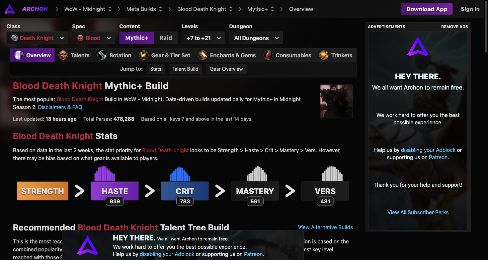

# 鲜血死亡骑士天赋配置

数据来源于 Warcraft Logs 与 Archon 近两周 478,288 份 +7 至 +22 层大秘境有效记录。

## 英雄天赋对比（Hero Talents）

| 英雄天赋 | 大秘境使用率 | 大秘境均伤 (DPS) | 团本史诗使用率 | 团本史诗承伤表现 | 特点定位 |
| :--- | :--- | :--- | :--- | :--- | :--- |
| **萨莱茵 (San'layn)** | **90.0%** (统治级核心) | **208.0k** | **86.4%** | 高自愈与高容错 | 吸血鬼打击高频触发急速增益、吸血与血兽自爆，大秘境聚怪清怪兼具极强生存 |
| **死亡使者 (Deathbringer)** | 9.9% | 152.6k | 13.6% | 偏物理硬度防猝死 | 强化护甲与死神印记减伤，适合部分物理尖峰单体首领战 |

### 1. 萨莱茵（大秘境主流核心）机制详解
- **吸血打击（Vampiric Strike）**：心脏打击有高几率被替换为吸血打击，造成暗霜伤害并为你恢复相当于造成伤害百分比的生命值，同时缩减吸血鬼之血的冷却时间。
- **疯狂吸血鬼（Essence of the Blood Queen）**：每次触发吸血打击提高自身急速与吸血，在大秘境拉多只小怪波次中几乎常驻叠满。
- **血兽爆裂（Blood Beast）**：吸血打击高频召唤血兽，血兽储存造成的暗影伤害并在结束时引爆，为坦克提供强大的全程伤害贡献。

### 2. 死亡使者机制详解
- **死神印记防御向收益**：死神印记在场时减少目标对你造成的伤害，并在引爆时提供吸收护盾。
- **暗霜护盾**：消耗符文时有几率获得暗霜护甲加成，进一步强化物理平砍减伤。

---

## 大秘境通用加点推荐（骨盾维持 + 鲜血禁锢自疗体系）

### 职业通用树核心
- 死亡脚步（强化移速与防击退）
- 反魔法护罩（AMS，魔法尖峰与免控）
- 窒息（单体强断条/定身昏迷）
- 死亡之握（双充能，单体定位拉怪）
- 盲目冰雨（群控断条）
- 血魔之握（Gorefiend's Grasp，核心大范围群体聚怪神技）
- 反魔法领域（AMZ，提供团队法术减伤保护）
- 巫妖之躯（防恐惧及被动减伤自疗）

### 鲜血专精树核心
1. **基础防线（骨盾与减伤）**：
   - 骨髓分裂（Marrowrend）：消耗 2 符文产生 3 层骨盾。
   - 白骨风暴（Bonestorm）：消耗骨盾或能量造成范围顺劈自愈。
   - 永恒脐带（Umbilical Cord）：吸血鬼之血结束时为自身提供吸收护盾。
2. **中层（资源与顺劈）**：
   - 鲜血灌注与赤红渴望（Red Thirst）：每次消耗符文能量大幅缩短吸血鬼之血冷却，实现吸血鬼之血高覆盖。
   - 心脏打击强化（多目标顺劈与能量生成）。
   - 紧绷之握与腐化之血。
3. **底层（爆发与终极防御）**：
   - 符文刃舞（Dancing Rune Weapon）：核心爆发与招架防御大招，提供 40% 招架率与符文能量倍增。
   - 墓石（Tombstone）：消耗骨盾换取高额全额吸收盾并缩短符文刃舞冷却。
   - 炼血术与吸血鬼之血强化分支。
