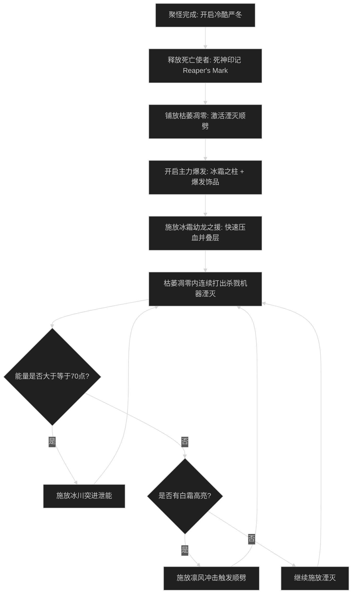
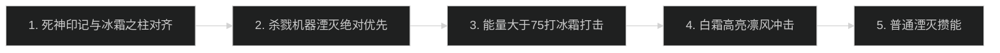

# 冰霜死亡骑士输出手法与施法优先级

## 1. 核心资源循环与原则

- **符文（Runes）与符文能量（Runic Power）互转体系**：
  - 符文消耗技能：湮灭（消耗 2 个符文，产生 20 点符文能量）、冷酷严冬（消耗 1 个符文）、枯萎凋零（消耗 1 个符文）。
  - 符文能量消耗技能：冰霜打击（单体消耗 30 点能量）、冰川突进（多目标消耗 30 点能量）。
  - **核心防溢出原则**：
    - 符文锁定防浪费：保持至少 3 个符文处于冷却恢复状态，严禁符文满 6 个停滞超过 1 个 GCD。
    - 能量泄能防溢出：当符文能量超过 70 点时，立即穿插冰霜打击或冰川突进泄能，防止湮灭产生的 20 点能量直接溢出丢失。
    - 杀戮机器（Killing Machine）即刻打出：平砍暴击或大招触发杀戮机器后，下一个 GCD 必须打出湮灭，不得被普通泄能技能挤占。

---

## 2. 大秘境 AOE 爆发循环（死亡使者 Deathbringer 流派）

### 阶段一：起手爆发时序
1. 聚怪就位前开启冷酷严冬，提前开始叠加汇聚风暴层数。
2. 目标聚齐瞬间对主目标施加死神印记（Reaper's Mark）。
3. 脚下铺放枯萎凋零，激活湮灭的多目标顺劈效果。
4. 开启冰霜之柱（Pillar of Frost）并同步使用主动爆发饰品（如共鸣风箱石）。
5. 打出冰霜幼龙之援（Frostwyrm's Fury），造成大范围冰霜伤害并直接拉高死神印记充能层数。
6. 进入核心顺劈窗口：利用高频触发的杀戮机器，连续打出多目标湮灭。

### 阶段二：平稳顺劈循环
1. 保持冷酷严冬冷却完成即开，利用每次消耗符文延长其持续时间。
2. 枯萎凋零处于激活状态时，所有符文优先供湮灭顺劈使用。
3. 高亮白霜（Rime）触发时打出凛风冲击，维持冰霜疫病（Frost Fever）。
4. 符文能量达到 70 点以上时施放冰川突进进行范围伤害并泄能，避免能量浪费。

---

## 3. 团本单体输出优先级

1. **死神印记卡 CD 施放**，严格与冰霜之柱爆发轴对齐。
2. **杀戮机器高亮湮灭**：绝对第一优先级，打在死神印记窗口内伤害翻倍。
3. **高位泄能**：符文能量大于等于 75 点时，施放冰霜打击防止能量溢出。
4. **白霜高亮**：触发免费凛风冲击时立即打出，刷新疾病并产生额外伤害。
5. **普通湮灭**：消耗溢出的符文并转化为符文能量。
6. **低位控能**：若所有符文均在恢复中且能量低于 30 点，等待平砍触发杀戮机器，不盲目乱按。

---

## 4. 新手易犯错误自查

1. **不在枯萎凋零内打湮灭**：
   - 表现：大秘境多目标波次全程湮灭占比过低，伤害大幅落后。
   - 改进动作：起手聚怪后必须先放枯萎凋零，站桩期间所有湮灭均自动顺劈周围目标；凋零消失前不要移动出圈。
2. **杀戮机器被普通冰霜打击顶替**：
   - 表现：触发高亮杀戮机器后按错泄能键，浪费必爆湮灭窗口。
   - 改进动作：监控杀戮机器高亮，高亮出现时仅允许按湮灭键，绝不按冰霜打击。
3. **能量长期 100 点溢出**：
   - 表现：在冰柱爆发期只顾按湮灭，能量持续顶在 100 点，失去大量的符文武器刷新与减 CD 联动。
   - 改进动作：在连续打完 2 个杀戮机器湮灭后，若能量超过 70 点，必须穿插 1 次冰川突进或冰霜打击泄能。
4. **冷酷严冬断档过早**：
   - 表现：开启冷酷严冬后未能及时消耗符文，导致汇聚风暴层数未能叠满即提前结束。
   - 改进动作：冷酷严冬开启后必须有足够的可用符文连续施放技能，以最大化维持冰霜风暴持续时间。
