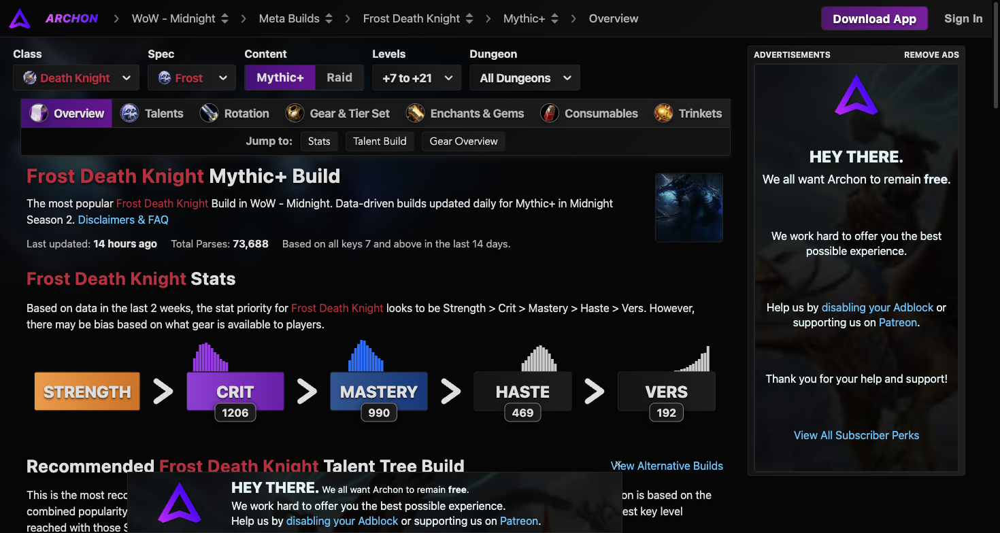

# 冰霜死亡骑士天赋配置

数据来源于 Warcraft Logs 与 Archon 近两周 73,688 份 +7 至 +21 层大秘境有效记录。

## 英雄天赋对比（Hero Talents）

| 英雄天赋 | 大秘境使用率 | 大秘境均伤 (DPS) | 团本史诗使用率 | 团本史诗均伤 | 特点定位 |
| :--- | :--- | :--- | :--- | :--- | :--- |
| **死亡使者 (Deathbringer)** | **98.2%** (绝对统治) | **296.9k** | **94.8%** | **268.5k** | 死神印记叠层引爆，暗霜顺劈极高，与冰霜之柱爆发窗口高度契合 |
| **天启骑士 (Rider of the Apocalypse)** | 1.7% | 249.0k | 5.2% | 251.2k | 固定轴召唤四骑士，位移与护甲优势，多用于特定位移频繁的史诗首领战 |

### 1. 死亡使者（核心主流）机制详解
- **死神印记（Reaper's Mark）**：对目标施加死神印记，使后续消耗符文与符文能量的技能为印记充能叠层。印记结束或叠加至上限时引爆，对目标及周围所有敌人造成巨额暗霜伤害。
- **冷面死神（Grim Reaper）**：湮灭与杀戮机器暴击会大幅加快死神印记的充能速度，并使引爆伤害进一步顺劈至周围目标。
- **至暗严寒**：在死神印记存在期间，冷酷严冬的伤害提高，并延长印记期间的减伤覆盖。

### 2. 天启骑士机制详解
- **四骑士降临**：施放冰霜之柱时自动召唤一名天启骑士助战，提供直伤与功能性光环。
- **机动性优势**：提供马背施法与免控移速，适合需要远距离位移但不能停手的特殊战斗场景。

---

## 大秘境通用加点推荐（双持湮灭 + 冰川突进体系）

### 职业天赋通用树必点核心
- 死亡脚步（Death's Advance）及强化移速
- 反魔法护罩（AMS）及吸收量强化
- 冰封心智（Mind Freeze，打断）
- 窒息（Asphyxiation，单体昏迷）
- 死亡之握强化与充能（聚怪核心）
- 致盲冰雨（Blinding Sleet，5 目标群体瘫痪与断条）
- 反魔法领域（AMZ，团队法术大减伤）
- 巫妖之躯（防恐惧并提供吸血自疗）

### 冰霜专精树核心
1. **第一层至第三层**：
   - 杀戮机器（Killing Machine）：平砍触发，使下一次湮灭必暴击且造成冰霜伤害。
   - 白霜（Rime）：湮灭有几率使下一次凛风冲击不消耗符文并造成 225% 额外伤害。
   - 强化冰霜打击与冰川突进（Glacial Advance）。
2. **中层**：
   - 冷酷严冬（Remorseless Winter）与汇聚风暴（Gathering Storm）：冷酷严冬持续期间每次消耗符文均延长其持续时间并叠加伤害。
   - 冰霜之柱（Pillar of Frost）：主力爆发大招，提供力量提升并配合杀戮机器连续爆发。
   - 冰龙吐息（Breath of Sindragosa）或湮灭强化分支：在大秘境主流高层中，双持湮灭 + 破灭强化构建稳定 45 秒一波的高爆发节奏。
3. **底层**：
   - 冰霜幼龙之援（Frostwyrm's Fury）：核心大招，对正前方所有敌人造成毁灭性冰霜伤害并施加深度冰冻减速。
   - 永冻之霜与破灭打击强化：在冰霜之柱期间进一步放大杀戮机器触发频率与伤害倍率。
