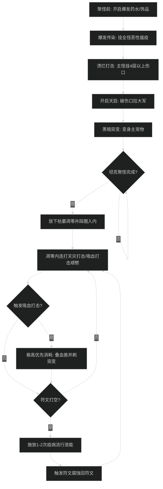

# 邪恶死亡骑士输出手法与施法优先级

## 1. 核心资源循环与机制

- **双资源系统**：符文（Runes）与符文能量（Runic Power）。
  - 符文用于施放核心物理/暗影技能（溃烂打击、天灾打击、枯萎凋零），消耗符文产生符文能量。
  - 符文能量用于施放消耗技能（凋零缠绕、疫病流行），消耗符文能量通过末日突降（Sudden Doom）机制返还符文并缩短黑暗突变冷却。
- **伤口机制（Festering Wounds）**：
  - 溃烂打击给目标施加 2-3 层伤口（最高 6 层）。
  - 天灾打击（或吸血打击）引爆 1 层伤口，触发爆裂之疡并叠一层溃烂之力（提升力量）。
- **凋零顺劈机制**：
  - 站在枯萎凋零（Death and Decay）内，天灾打击/吸血打击自动顺劈周围至多 5-8 个目标，同时引爆所有受击目标身上的伤口。

---

## 2. 大秘境 AOE 爆发循环（萨莱茵流派）

### 阶段一：起手铺垫（进入怪堆前至聚怪初）
1. 预铺爆发饰品或主动药水。
2. 开启**爆发传染（Outbreak）**，确保全怪挂上恶性瘟疫。
3. 聚怪过程中对血量最高的怪打 1-2 次**溃烂打击（Festering Strike）**挂 4 层以上伤口。
4. 开启**天启（Apocalypse）**引爆 4 层伤口，召唤食尸鬼并触发被动符文加速。
5. 开启**黑暗突变（Dark Transformation）**，变身主宝宝，使横扫变为全额顺劈。

### 阶段二：枯萎凋零核心爆发窗口（最高优先级）
1. 怪群聚拢稳定后，立刻放下**枯萎凋零（Death and Decay）**，角色务必站入圈内。
2. **在圈内全力连打天灾打击（Scourge Strike）或触发的吸血打击（Vampiric Strike）**：
   - 只要圈内有怪且身上有伤口，每一次天灾打击都会引发全场爆裂之疡，伤口引爆会迅速叠满溃烂之力（力量提升 20%+）。
   - 触发吸血打击时，绝对优先打吸血打击，触发血兽生成并刷新突变时间。
3. 符文耗尽时，施放 1-2 次**疫病流行（Epidemic）**泄能，触发符文腐蚀（Runic Corruption）快速回符文，然后立刻切回天灾打击。
4. **原则**：凋零持续 10-12 秒内，切忌把 GCD 浪费在补瘟疫或无意义走位上，打满每一发顺劈。

### 阶段三：平稳期与收尾
1. 凋零结束后，血兽即将自爆，利用凋零缠绕/疫病流行继续填充暗影伤害，让血兽记录伤害最大化。
2. 针对高血量残血大怪补溃烂打击 + 吸血打击，为下一波怪预留 3-4 个符文与 60+ 符文能量。

---

## 3. 团本单体输出优先级

1. 保持目标身上的**恶性瘟疫**不断。
2. 冷却好了就开**黑暗突变**与**天启**（天启前确保目标有至少 4 层溃烂伤口）。
3. 当目标伤口低于 2 层时，打**溃烂打击**补伤口至 4 层左右。
4. 触发**吸血打击**或**末日突降（免费凋零缠绕）**时优先消耗。
5. 符文能量高于 80 点时，打**凋零缠绕（Death Coil）**防能量溢出，并刷突变 CD。
6. 符文充裕（3个及以上）时，打**天灾打击**消耗符文并引爆伤口。
7. 目标斩杀期（35% 血以下），配合断头秘技饰品打入斩杀循环。

---

## 4. 新手易犯错误自查

1. **凋零空放或站圈外**：
   - 常见失误：刚踩凋零，坦克把怪拉走了；或者自己站在凋零外面打天灾打击，导致顺劈无法触发。
   - 改进动作：等坦克聚怪停步后再放凋零；凋零放完后角色必须脚踩圈内。
2. **怪群中无脑按疫病流行（Epidemic）**：
   - 常见失误：看到怪多就狂按疫病流行，导致符文充能空转、凋零顺劈打不满。
   - 改进动作：大秘境伤害大头是“凋零内天灾打击爆伤口 + 萨莱茵血兽自爆”。疫病流行仅作为符文打空时的泄能手段，不能挤占天灾打击的 GCD。
3. **天启没伤口就按**：
   - 常见失误：开怪直接按天启，因目标无伤口导致无法召唤大军且浪费冷却。
   - 改进动作：必须先溃烂打击看到目标头顶有 4 层及以上伤口，再按天启。
4. **溃烂伤口溢出**：
   - 伤口上限为 6 层。目标已有 5-6 层伤口时，再打溃烂打击就完全浪费了符文。
