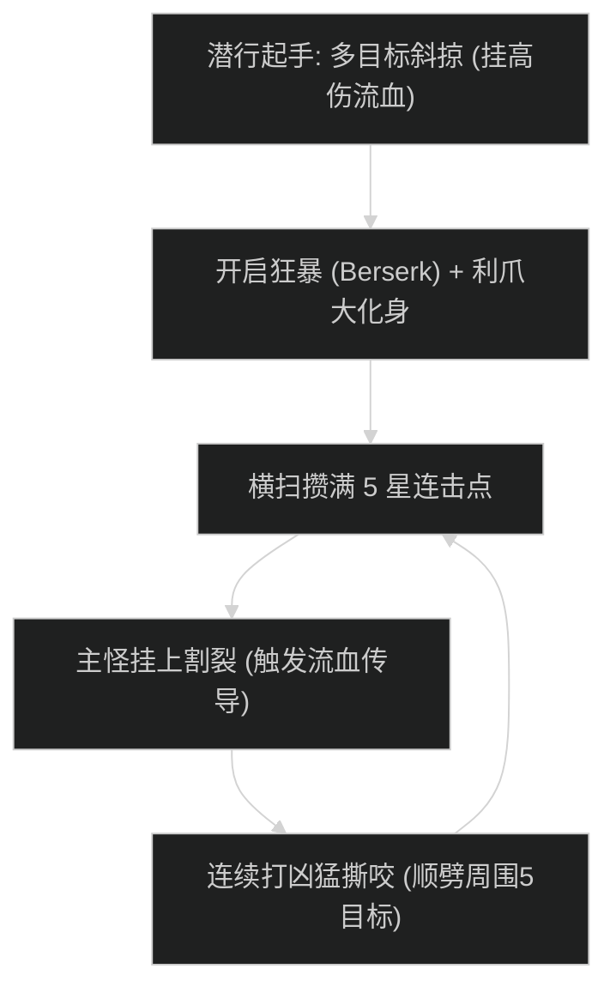

# 野性德鲁伊实战手法与循环优先级

## 1. 核心资源循环与机制

- **基础机制**：潜行斜掠起手，横扫多目标割裂，狂暴期间利爪德鲁伊巨化撕咬大范围顺劈暴击。
- **资源防溢出原则**：核心资源（怒气/能量/精华/法力/连击点）严禁在满溢状态下继续打产能技能。
- **英雄天赋联动**：在开启主力爆发技能时，必须对齐利爪德鲁伊的核心触发窗口。

---

## 2. 大秘境实战流程图

### 实战阶段详解
1. **起手阶段**：挂上核心增益与弱化 Dot，开启主动爆发手牌与主动饰品。
2. **爆发阶段**：对齐大招与英雄天赋核心加成，倾泻所有核心产能与泄能连击。
3. **平稳收尾阶段**：合理保留资源迎接下一波小怪拉怪或 Boss 转阶段。

---

## 3. 新手易错自查清单

- [ ] **爆发手牌错位**：未将饰品与核心大招对齐施放，导致爆发期收益大打折扣。
- [ ] **核心资源溢出**：在高压或急速拉满期只顾狂按同一技能，导致关键能量持续浪费。
- [ ] **减伤打断遗忘**：沉迷打伤害而忽略本专精关键打断与硬控技能。
