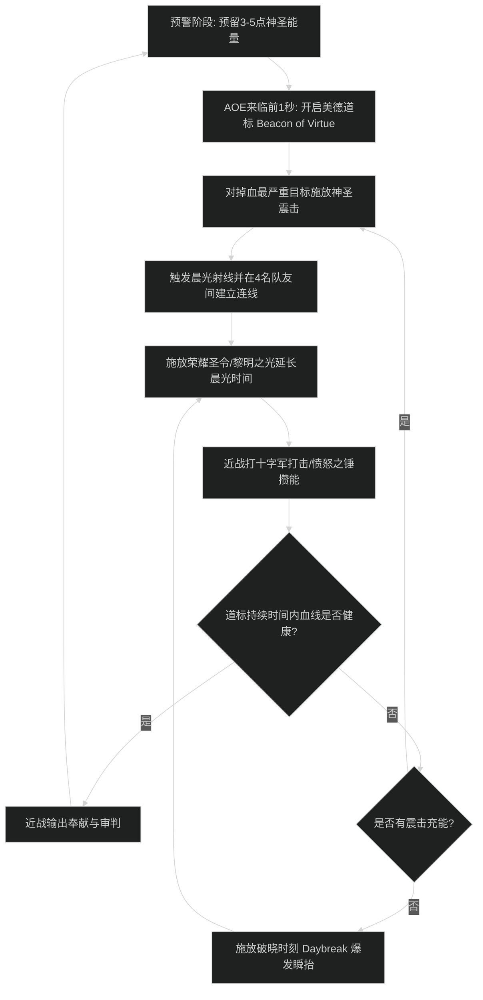

# 神圣圣骑士抬血循环与施法优先级

## 1. 核心资源循环与原则

- **神圣能量（Holy Power）与法力值控制**：
  - 产生能量技能：神圣震击（获得 1 点能量）、十字军打击（获得 1 点能量）、愤怒之锤（获得 1 点能量）。
  - 消耗能量技能：荣耀圣令（单体消耗 3 点能量）、黎明之光（5 目标前向锥形消耗 3 点能量）。
  - **核心防溢出原则**：
    - 能量达到 3 点必须立即施放终结技，严禁在 5 点能量上限时施放神圣震击导致圣能浪费。
    - 神圣震击必须卡 CD 使用，充能绝不能停在 2 层满溢状态。
    - 站在近战位施法，利用精通：光明使者（距离越近治疗量越高）拉满治疗收益，同时打十字军打击回能。

---

## 2. 大秘境队伍 AOE 尖峰抬血循环（太阳先锋 Herald of the Sun 流派）

### 阶段一：高压前奏与道标铺设
1. 在 BOSS 或小怪大范围读条 AOE 前 3 秒，停止无谓泄能，积攒 3-5 点神圣能量。
2. 尖峰伤害来临前 1 秒开启美德道标（Beacon of Virtue），使自身与 4 名队友同时获得道标复制效果。
3. 伤害跳出的瞬间，对血量最低的队友打出神圣震击（Holy Shock），瞬间触发晨光射线。
4. 立即打出荣耀圣令（单体）或黎明之光（群体），通过道标将单体高额治疗 50% 复制给全队，并延长晨光射线持续时间。

### 阶段二：持续抬血与近战回能
1. 连续打出十字军打击与愤怒之锤快速积攒圣能，只要有 3 点能量立刻再次打出荣耀圣令。
2. 遇到极度危险血线时开启复仇之怒（翅膀）或主动饰品（如货运者之瓶）。
3. 当神圣震击冷却中且全队血线危急时，按下破晓时刻（Daybreak），消耗所有震击能量瞬间完成全队大抬血。

### 阶段三：紧急急救（Triage）与法力经济判定
1. **急救优先级**：身上带有点名高额持续伤害（Dot）或血线低于 25% 的队友 > 坦克 > 其他 DPS > 自身（自身有被动减伤与无敌手牌保底）。
2. **法力经济控制**：
   - 平稳期严禁频繁使用高蓝耗的圣光闪现，多用免费发光的荣耀圣令与震击抬血。
   - 充分利用近战位平砍与十字军打击攒能，实现“零蓝耗”圣能周转。
   - 史诗团本每波大 AOE 爆发后，如果全团血线脱离危险区（70% 以上），停止读条大技能，交由晨光 HoT 与其他治疗的被动技能平稳回满，杜绝过量治疗空竭法力。

---

## 3. 团本单体与平稳期近战输出转化优先级

1. **神圣震击绝对卡 CD 施放**，平稳期打敌人输出兼顾回能，掉血期打队友急救。
2. **3 点圣能即刻倾泻**：血量平稳时打盾击补伤害，有队友缺血时打荣耀圣令。
3. **愤怒之锤卡 CD 施放**：提供高额神圣直伤并稳定产出 1 点神圣能量。
4. **十字军打击填充**：近战位平砍期间穿插十字军打击，维持圣能连续进账。
5. **地面铺放奉献**：不占用核心治疗 GCD，补充全程 DPS 贡献。

---

## 4. 新手易犯错误自查

1. **远程位站桩读条圣光术**：
   - 表现：站在 40 码外慢吞吞读圣光闪现，精通收益直接降到冰点，且无法打十字军打击产圣能。
   - 改进动作：神圣圣骑士是纯正的近战治疗，必须贴近怪物红圈站位，利用震击、十字军打击与瞬发终结技抬血。
2. **美德道标开得过早或过晚**：
   - 表现：怪物还没开始 AOE 就提前交了美德道标，伤害打出来时道标持续时间已经结束；或者全员残血了才开道标，手忙脚乱救不回来。
   - 改进动作：监控 DBM/BigWigs 的 AOE 倒数计时，在伤害命中的前 1-1.5 秒按下美德道标，确保整个 8 秒窗口吃满治疗复制。
3. **满圣能不打终结技**：
   - 表现：神圣能量到了 5 点还在打十字军打击或神圣震击，导致后续能量全额溢出浪费。
   - 改进动作：只要圣能到达 3 点以上，下一个 GCD 必须是荣耀圣令、黎明之光或正义之盾。
4. **舍不得开翅膀与大减伤**：
   - 表现：复仇之怒冷却仅 2 分钟，光环掌握整场只开 1 次，队伍濒死才想起来开大招。
   - 改进动作：大秘境中每波压力怪直接交翅膀抬血兼顾打伤害；高额魔法 AOE 提前 1 秒开启光环掌握覆盖。
