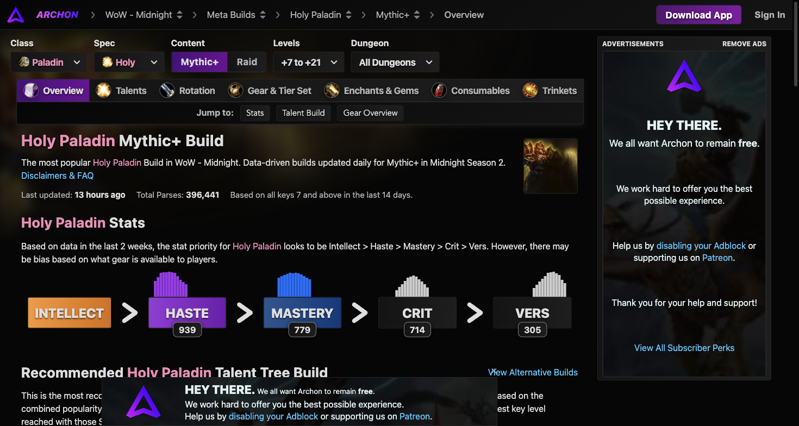

# 神圣圣骑士天赋配置

数据来源于 Warcraft Logs 与 Archon 近两周 396,441 份 +7 至 +21 层大秘境有效记录。

## 英雄天赋对比（Hero Talents）

| 英雄天赋 | 大秘境使用率 | 大秘境治疗均值 (HPS) | 团本史诗使用率 | 特点定位 |
| :--- | :--- | :--- | :--- | :--- |
| **太阳先锋 (Herald of the Sun)** | **69.9%** (主流统治) | **157.6k** | **71.2%** | 晨光射线在队友间智能连线跳跃回血，兼顾高额被动顺劈输出，大秘境第一选择 |
| **铸光者 (Lightsmith)** | 30.0% | 178.0k | 28.8% | 圣圣武装提供高额吸收护盾，偏向防猝死与硬度保障，特定超高压环境首选 |

### 1. 太阳先锋（大秘境核心主流）机制详解
- **晨光（Dawnlight）**：施放神圣震击或灰烬觉醒后，在受治疗的目标与自身之间建立晨光射线，持续向受影响目标注入生命恢复，并在周围敌人受到神圣伤害时产生顺劈。
- **太阳耀斑（Sun's Avatar）**：在复仇之怒（翅膀）开启期间，晨光射线条数翻倍，极大提高爆发抬血的智能覆盖面。
- **永恒圣光联动**：施放荣耀圣令或黎明之光会延长晨光射线的持续时间，形成“震击 -> 圣能终结技 -> 延长晨光”的高效平滑循环。

### 2. 铸光者机制详解
- **圣圣武装（Holy Bulwark）**：向队友投掷吸收护盾，在队友承受高额物理或魔法伤害时自动吸收并反弹神圣伤害。
- **铸光圣兵（Sacred Weapon）**：提高目标主属性，并使其攻击产生神圣顺劈治疗效果。

---

## 大秘境通用加点推荐（美德道标 + 太阳先锋近战急救体系）

### 职业通用树核心
- 责难（Rebuke，近战打断）
- 制裁之锤（Hammer of Justice，单体昏迷断条）
- 盲目之光（Blinding Sleet，5 目标群体断条与瘫痪）
- 骑乘战马（双充能机动性）
- 保护祝福、牺牲祝福与自由祝福（全方位团队保护手牌）
- 圣疗术（瞬发保底救急）
- 清毒术（驱散毒素与疾病）
- 光环掌握（Devotion Aura Mastery，核心全团硬减伤大招）

### 神圣专精树核心
1. **基础圣能与震击**：
   - 神圣震击强化与双充能：核心产能在手技能。
   - 圣光灌注（Infusion of Light）：震击暴击使圣光闪现与圣光审判大幅强化。
   - 十字军打击（Crusader Strike）与信仰审判。
2. **中层（道标与群体抬血）**：
   - 美德道标（Beacon of Virtue）：大秘境唯一核心道标天赋，开启后将对主目标的治疗 50% 复制到周围 4 名受伤队友身上。
   - 黎明之光（Light of Dawn）与觉醒强化。
   - 提尔之救（Tyr's Deliverance）：施放后为周围队友提供持续 HoT 并提升对其直接治疗效果。
3. **底层（爆发与急速周转）**：
   - 复仇之怒（Avenging Wrath / 翅膀）：大幅提升暴击率、伤害与治疗量。
   - 苍穹之锤与破晓时刻（Daybreak）：消耗所有震击充能，将晨光射线转化为全队爆发瞬间大抬。
