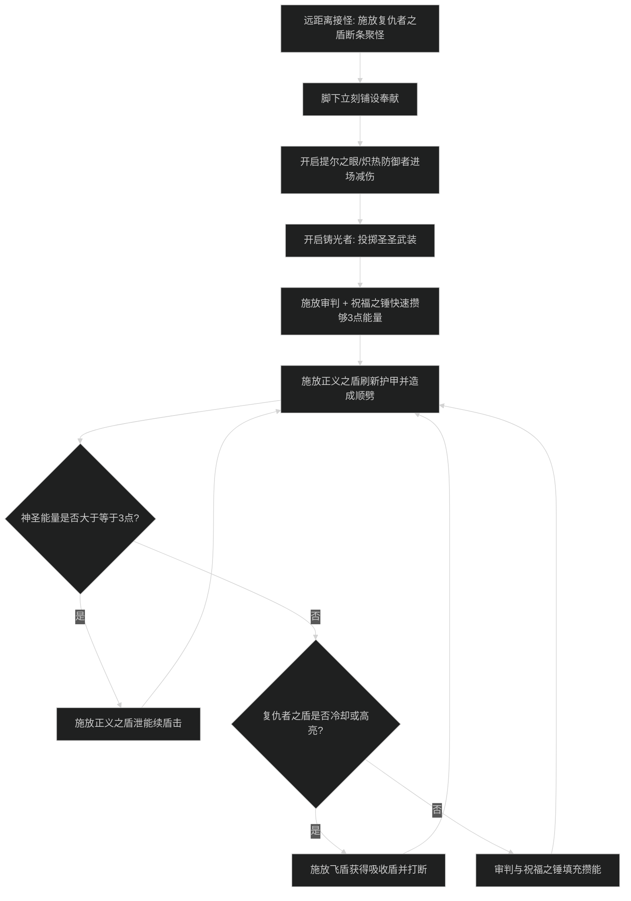

# 防护圣骑士减伤循环与施法优先级

## 1. 核心资源循环与原则

- **神圣能量（Holy Power）与正义之盾**：
  - 产生能量技能：审判（获得 1 点能量）、祝福之锤（获得 1 点能量）、复仇者之盾（强化天赋下可获得 1 点能量）。
  - 消耗能量技能：正义之盾（消耗 3 点能量，提升巨额护甲并造成伤害，持续 4.5 秒）、荣耀圣令（消耗 3 点能量或免费发光触发，用于紧急抬血）。
  - **核心防溢出原则**：
    - 能量达到 3 点必须立即施放正义之盾，严禁在 5 点能量上限下继续使用审判或祝福之锤造成能量浪费。
    - 正义之盾护甲覆盖率必须保持在 95% 以上，不得在盾击断档期间承受怪物的近战平砍。
    - 脚下必须常驻奉献（Consecration），离开奉献会失去大量的精通减伤与减速控制。

---

## 2. 大秘境 AOE 爆发循环（铸光者 Lightsmith 流派）

### 阶段一：起手接怪时序
1. 在接近怪堆 30 码距离时，施放复仇者之盾（Avenger's Shield）建立第一波仇恨并打断远程怪读条。
2. 贴近怪堆瞬间立刻脚下铺放奉献（Consecration），确保第一时间享受到奉献减伤。
3. 面对多只怪物施放提尔之眼（Eye of Tyr），瞬间降低周围所有怪物的物理伤害。
4. 使用铸光者技能施放圣圣武装（Holy Bulwark），为自身与队友挂上全额吸收护盾。
5. 施放审判与祝福之锤快速积攒 3 点神圣能量，并在受到第一记怪物平砍前打出正义之盾。

### 阶段二：站桩平稳抗怪循环
1. 监控正义之盾持续时间，只要有 3 点能量即打出正义之盾，使护甲增益时间向后堆叠。
2. 保持奉献常驻，若怪物位移则同步重新铺放奉献。
3. 触发大十字军高亮时，优先打出复仇者之盾，叠满吸收护盾。
4. 遇到队伍掉血高压波次，施放免费发光的荣耀圣令协助治疗单抬队友。

### 阶段三：首领死刑技能（Tank Buster）应对协议
1. **死刑读条前 2 秒**：确保正义之盾剩余时间大于 4 秒（若不足立刻打盾击刷新），且自身绝对站在奉献范围内。
2. **死刑读条中**：交替覆盖中短 CD 减伤技能：
   - 常规物理尖峰：提前开启炽热防御者（Ardent Defender，提供 20% 减伤且自带致死免疫保底），并投掷圣圣武装吸收护盾。
   - 毁灭性混合伤害死刑：开启提尔之眼（Eye of Tyr）降低敌人伤害，或直接开启远古列王守卫（Guardian of Ancient Kings，50% 全额硬减伤）。
3. **死刑命中瞬间（0.5 秒内）**：若血线出现缺口，打出免费触发的发光荣耀圣令瞬抬自身，并立刻补充审判与转锤积攒下一次盾击能量。

---

## 3. 团本单体抗首领防御优先级

1. **正义之盾 100% 覆盖**：首领平砍极重，严禁在无盾击状态下承受首领攻击。
2. **奉献踩满**：绝对不可走出脚下的奉献范围。
3. **应对首领高伤技能**：
   - 常规物理重劈：提前开炽热防御者（Ardent Defender）。
   - 致命毁灭连击：开启远古列王守卫（Guardian of Ancient Kings）配合圣圣武装吸收。
4. **审判卡 CD 施放**：保证能量快速获取与破甲易伤常驻。
5. **祝福之锤填充**：卡 CD 旋转锤子削弱首领平砍并维持能量周转。

---

## 4. 新手易犯错误自查

1. **走出奉献打怪**：
   - 表现：怪物稍微位移，自己跑出奉献圈却不补奉献，自身精通减伤直接失效导致大掉血。
   - 改进动作：随时观察脚下奉献光效，只要离开奉献范围，立即用 1 个 GCD 重新铺设奉献。
2. **正义之盾断档**：
   - 表现：盾击时间掉到 0 秒后还在慢吞吞打审判，导致怪物平砍直接打在裸体护甲上暴毙。
   - 改进动作：盾击剩余 1.5 秒以内即要补按正义之盾，让护甲时间始终保持在 4-9 秒安全区间。
3. **把能量全拿去打荣耀圣令**：
   - 表现：掉血后慌张狂按荣耀圣令，导致正义之盾断档，反而受到更多平砍伤害。
   - 改进动作：只有在触发免费发光的闪光圣令时才按荣耀圣令；其余神圣能量全部优先用于正义之盾保持护甲。
4. **忘记使用强大的团队祝福技能**：
   - 表现：队友吃物理点名或减速快死，自己身上捏着保护祝福和自由祝福不交。
   - 改进动作：在大秘境中养成监控队友框架的习惯，见物理流血点名直接给保护祝福，中毒及时交清毒术。
