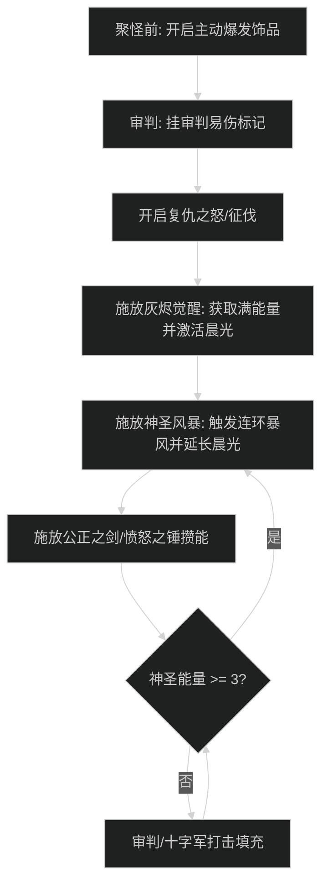

# 惩戒圣骑士输出手法与施法优先级

## 1. 核心资源循环与原则

- **神圣能量（Holy Power，上限 5 点）**：
  - 核心逻辑：以最快速度产生 3-5 点神圣能量，然后打出终结技。
  - **严禁能量溢出**：当拥有 4-5 点神圣能量时，不要打产生 2 点能量的技能（如公正之剑或灰烬觉醒），必须先打终结技泄能。
- **目标数量分支**：
  - **单体（1-2目标）**：终结技打最终审判（Final Verdict）。
  - **多目标（3目标及以上）**：终结技打神圣风暴（Divine Storm）。

---

## 2. 大秘境 AOE 爆发循环（太阳先锋流派）

### 阶段一：起手爆发时序
1. 开怪前开启主动饰品。
2. 远程打**审判（Judgment）**命中主目标，挂上审判增伤 Debuff。
3. 开启**复仇之怒（Avenging Wrath / 征伐）**。
4. 贴怪后立刻打**灰烬觉醒（Wake of Ashes）**：
   - 立即获得 3-5 点神圣能量。
   - 激活太阳先锋的**双道晨光射线（Dawnlight）**。
5. 立即施放**神圣风暴（Divine Storm）**消耗能量，触发多目标暴风之怒顺劈。

### 阶段二：平稳顺劈循环
1. 神圣能量达到 3 点或以上，且目标 >= 3 时，打**神圣风暴**。
2. 亮起的**愤怒之锤（Hammer of Wrath）**优先打（产生能量且数值极高）。
3. 施放**公正之剑**产生 2 点能量。
4. 施放**审判**保持目标易伤并产生 1 点能量。
5. 用**十字军打击 / 炽热打击**填充空白 GCD。

---

## 3. 团本单体优先级

1. 复仇之怒期间卡冷却打**灰烬觉醒**。
2. 神圣能量达到 4-5 点时，打**最终审判**防止能量溢出。
3. 优先消耗**愤怒之锤**（血量斩杀期或翅膀期）。
4. 施放**公正之剑**（产生 2 点能量）。
5. 施放**审判**（保持审判 Debuff）。
6. 用**十字军打击**填充。

---

## 4. 新手易犯错误自查

1. **神圣能量严重溢出**：
   - 常见失误：已有 4 点能量，依然按公正之剑，溢出浪费 1 点能量；或者已有 3 点能量直接按灰烬觉醒，浪费 2-3 点能量。
   - 改进动作：监控能量条，能量达到 3-4 点必须立刻按神圣风暴或最终审判。
2. **多目标仍手抖按裁决**：
   - 常见失误：怪堆里按习惯打了单体裁决。
   - 改进动作：只要场上有 3 只及以上怪，所有终结技一律锁定神圣风暴。
3. **忽略团队辅助手牌**：
   - 常见失误：只顾打伤害，忘记圣疗、牺牲祝福与清毒。
   - 改进动作：大秘境高压时，牺牲祝福给脆皮队友，清毒术秒解中毒与疾病，圣疗术救急坦克，这是惩戒骑进组的核心竞争力。
