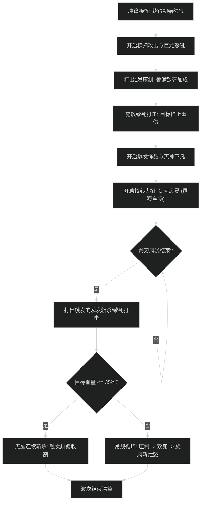

# 武器战士输出手法与施法优先级

## 1. 核心资源循环与机制

- **怒气管理（Rage Management）**：
  - 普攻与冲锋产生怒气；压制为免费技能且强化致死打击与下一次消耗技。
  - 致死打击消耗 30 怒气，施加核心流血（重伤）；斩杀消耗 20-40 怒气造成毁灭性打击。
  - 严禁空怒发呆，也不可在怒气溢出（>85 怒）时连续空转压制。
- **横扫顺劈机制（Sweeping Strikes）**：
  - 持续时间内所有单体技能（致死、压制、斩杀、猛击）复制至附近的额外 1 个目标，是 2-3 目标战斗的核心骨架。
- **屠戮者斩击（Slayer's Strike）**：
  - 施放剑刃风暴时自动频繁释放屠戮打击，造成高额暗影物理顺劈并给所有目标施加弱点标记。

---

## 2. 大秘境 AOE 爆发循环（屠戮者流派）

### 阶段一：起手聚怪与铺垫
1. 冲锋（Charge）主目标获取起始怒气。
2. 开启**横扫攻击（Sweeping Strikes）**与**巨龙怒吼（Dragon Roar）**造成群体致残与流血。
3. 打出 1 次**压制（Overpower）**获取两层强化 BUFF。
4. 打出**致死打击（Mortal Strike）**给主目标挂上重伤，并触发横扫溅射。

### 阶段二：屠戮爆发核心窗口
1. 开启主动饰品与天神下凡（Avatar）。
2. 立刻按下**剑刃风暴（Bladestorm）**进入引导阶段。
3. 引导期间屠戮者天赋自动向周围最多 8 个目标泼洒屠戮斩击，造成瞬时巨额爆发峰值。

### 阶段三：风暴后收尾与斩杀循环
1. 剑刃风暴结束后，优先打出由于弱点标记触发的免费瞬发斩杀（Execute）。
2. 若怪群血量跌入 35% 以下，进入**斩杀收割阶段**：
   - 保持横扫攻击不间断；
   - 连续打出斩杀（Execute），利用猝死被动清空怒气打满双目标斩杀。

---

## 3. 单体输出优先级（首领战）

1. **斩杀期（目标生命 <= 35%）**：
   - 触发猝死（Sudden Death）时必打斩杀；
   - 怒气 >= 40 且致死打击 CD 好时打致死打击（刷新重伤）；
   - 其余时间连续倾泻斩杀。
2. **常规平稳期（目标生命 > 35%）**：
   - 压制充能达到 2 层（即将溢出）时优先打压制；
   - 致死打击（卡 CD 施放，保持重伤覆盖 95% 以上）；
   - 剑刃风暴（作为强力单体技能卡 CD 施放）；
   - 压制（填充）；
   - 猛击（怒气 > 60 时作为泄怒填充，严禁空怒）。

---

## 4. 新手实战避坑自查表

- [ ] **横扫漏开**：多目标合波时未提前开启横扫就直接转剑刃风暴，导致风暴结束后缺乏顺劈续航。
- [ ] **重伤断档**：首领战忘记卡 CD 致死打击，导致重伤层数自然消失。
- [ ] **剑刃风暴被打断**：开启剑刃风暴期间虽免疫控制，但若自身走位过快拉开怪群判定范围会导致屠戮斩击丢失命中。
- [ ] **怒气溢出**：在大招天神下凡期间盲目狂按无消耗的压制，导致平砍产生的怒气全部浪费。
