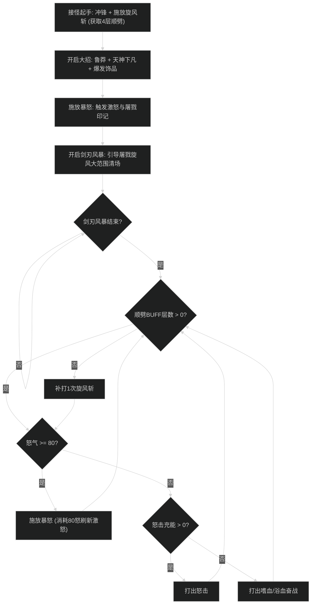

# 狂暴战士输出手法与施法优先级

## 1. 核心资源循环与机制

- **激怒覆盖（Enrage Uptime）**：
  - 狂暴战在激怒状态下造成伤害提高 20%（受精通大幅加成），急速提高 15%，受到伤害降低 10%。
  - 核心目标：保持激怒覆盖率 >= 92%。怒气达到 80 点时必须以最高优先级打出**暴怒（Rampage）**续上激怒。
- **旋风斩顺劈 BUFF**：
  - 施放 1 次旋风斩（Whirlwind）获得 4 层顺劈强化 BUFF，使接下来的 4 次单体攻击（怒击、嗜血、暴怒）自动对周围最多 4 个额外目标造成伤害。
  - 循环原则：“1 次旋风斩 + 4 次单体攻击”，严禁连续打旋风斩造成伤害损失。

---

## 2. 大秘境 AOE 顺劈循环（屠戮者流派）

### 阶段一：聚怪起手与顺劈激活
1. 冲锋接怪，第一时间打出 1 次**旋风斩（Whirlwind）**激活 4 层顺劈 BUFF。
2. 开启核心爆发手牌：**鲁莽（Recklessness）** + **天神下凡（Avatar）** + 爆发饰品。
3. 怒气拉满后打出第 1 发**暴怒（Rampage）**激活激怒状态。

### 阶段二：屠戮爆发核心窗口
1. 激怒状态激活后，立即开启**剑刃风暴（Bladestorm）**。
2. 屠戮者天赋自动向周围怪群泼洒毁灭性屠戮飞弹，完成大波次起手血量压制。

### 阶段三：平稳顺劈节奏（1+4 原则）
1. 时刻观察屏幕正中央的旋风斩顺劈 BUFF 计数。
2. 当层数耗尽归零时，必须立刻打 1 发**旋风斩**补充层数。
3. 在有顺劈 BUFF 时，单体优先级：
   - 怒气 >= 80：**暴怒（最高优先级，续激怒）**；
   - 怒击充能可用：打出**怒击（Raging Blow）**；
   - 怒击无充能：打出**嗜血（Bloodthirst）**产怒；
   - 斩杀亮起：打出**斩杀（Execute）**顺劈。

---

## 3. 单体输出优先级（首领战）

1. **暴怒（Rampage）**：怒气达到 80 点时必打；若自身激怒即将断档且怒气 >= 70 时打暴怒。
2. **猝死斩杀（Execute）**：触发猝死免费斩杀且当前处于激怒状态时打出。
3. **怒击（Raging Blow）**：充能即将溢出（2层）时打怒击。
4. **嗜血（Bloodthirst）**：作为核心产怒填充。
5. **旋风斩（Whirlwind）**：怒气打空且怒击、嗜血均进入冷却时的唯一无消耗填充。

---

## 4. 新手实战避坑自查表

- [ ] **断激怒输出**：在没有激怒状态下盲目倾泻技能，伤害直接损失 30% 以上。
- [ ] **顺劈断档发呆**：多目标战斗中旋风斩层数耗尽后，连续打单体怒击导致副目标完全没有顺劈伤害。
- [ ] **剑刃风暴前未打暴怒**：在没有激怒状态下直接开启剑刃风暴，导致风暴伤害完全吃不到精通加成。
