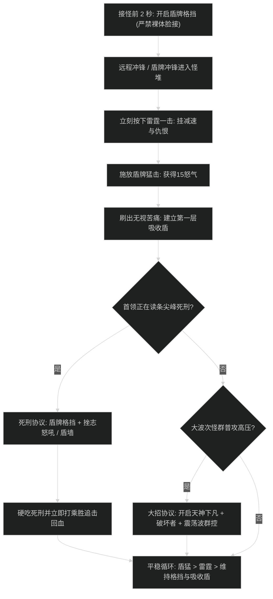

# 防护战士坦克循环与减伤应对协议

## 1. 核心生存循环与机制

- **盾牌格挡（Shield Block）全时维持**：
  - 消耗 30 怒气，使接下来 6 秒内所有物理攻击必定被格挡，并触发精确格挡（减伤 60%）。
  - 核心铁律：只要怪群接触到角色本体，**盾牌格挡覆盖率必须达到 99% 以上**，断格挡是防战猝死的第一原因。
- **无视苦痛（Ignore Pain）缓冲垫**：
  - 消耗 35 怒气，化解接下来受到的 50% 伤害，最高可叠加至自身最大生命值的 30%。
  - 在盾牌格挡已有富余充能时，怒气优先倾泻入无视苦痛。
- **怒气生成铁三角**：
  - 盾牌猛击（Shield Slam）：产生 15 怒气（单体核心产怒与伤害）；
  - 雷霆一击（Thunder Clap）：产生 5 怒气，给全怪挂挫志怒吼并扩散顺劈；
  - 盾牌冲锋与天神下凡：瞬间补满怒气池。

---

## 2. 接怪聚怪与死刑技能应对协议流程图

### 阶段一：接怪起手防猝死 SOP（黄金 3 秒）
1. **接怪前 2 秒**：在冲锋离怪尚有 15 码距离时，**提前按出盾牌格挡（Shield Block）**，确保肉身接怪的瞬间身上已有 100% 格挡 BUFF。
2. **冲锋入场**：使用**盾牌冲锋（Shield Charge）**或冲锋（Charge），瞬间获得 20 怒气并将主怪击晕。
3. **第一击雷霆**：立即施放**雷霆一击（Thunder Clap）**扩散仇恨与重伤。
4. **盾猛与吸盾**：接**盾牌猛击（Shield Slam）**产怒，瞬间按出第 1 层**无视苦痛（Ignore Pain）**。

### 阶段二：首领尖峰死刑技能（Tank Buster）应对协议
1. 观察首领读条（如剧毒穿刺、重骨粉碎）：
   - 保证**盾牌格挡**持续时间 > 4 秒；
   - 读条过半时，交出**挫志怒吼（Demoralizing Shout，自身减伤 20%）**或**法术反射（Spell Reflection，魔法死刑时减免 20%）**；
   - 若为史诗高层残暴死刑，提前覆盖**盾墙（Shield Wall，40%硬减伤）**或**破釜沉舟（Last Stand）**；
   - 技能命中结算后，立即打出**乘胜追击（Victory Rush）**或苦痛免疫回复 20% 生命值。

### 阶段三：群怪大波次控场循环
1. 开启**破坏者（Ravager）**在地面自动转旋风，怒气源源不断。
2. 开启**天神下凡（Avatar）**强化雷霆打击为雷霆风暴。
3. 当怪群读条或狂暴时，果断打出**震荡波（Shockwave）**造成 2.5 秒群体昏迷，为治疗争取缓冲时间。

---

## 3. 防战易错自查清单

- [ ] **裸体冲锋接怪**：未提前开启盾牌格挡就冲入高层大怪堆，起手瞬间吃 3 下未格挡普攻直接猝死。
- [ ] **贪输出打猛击**：把怒气浪费在猛击上，导致盾牌格挡断档。
- [ ] **法术反射遗忘**：面对全队法系尖峰 AOE 时未开法术反射，白白浪费 20% 魔法全伤减免。
- [ ] **挫志怒吼留着不用**：在山丘领主天赋下，挫志怒吼冷却极短，应作为常规减伤卡 CD 施放。
