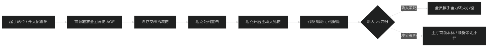

# [地下城中文名] 首领战机制与击杀指南

## 1. 1 号首领：[首领名称]

### 机制时序流程图

### 关键技能应对与职责拆解

- **全团尖峰 AOE ([技能名])**：
  - **新人打法**：见读条全员分散，治疗提前 2 秒铺回血，全团开启个人小减伤。
  - **冲分打法**：集合抱团吃微型领域/光环掌握，把位移时间转化为站桩输出。
- **坦克死刑 ([技能名])**：
  - 必须覆盖主动减伤（如血DK灵界打击盾、防骑盾击+圣佑术），严禁裸吃。
- **阶段转换与易伤窗口**：
  - 首领能量达到 100 时进入 15 秒虚弱眩晕状态，受伤害提高 50%。冲分队伍全员爆发药水与嗜血必须严格卡在此阶段释放。

---

## 2. 2 号首领：[首领名称]

[按 1 号相同结构展开]

---

## 3. 3 号首领：[首领名称]

[按 1 号相同结构展开]
