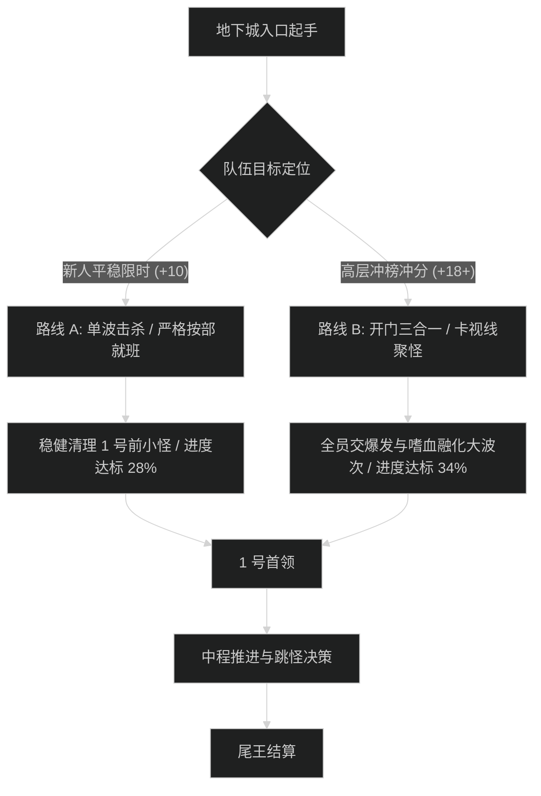

# [地下城中文名] 路线规划与拉怪时序 (新人 vs 冲分)

## 1. 路线决策流程图

## 2. 新人平稳推进路线 (Entry Route: +7 至 +12 层)

- **核心原则**：不合波、不强行跳怪；每波怪数量控制在 3-5 只；重点处理点杀目标。
- **进度规划**：通关进度目标为 101.5%（预留容错空间，防止中途漏怪回跑）。

### 拉怪波次清单 (Pull List)

| 波次 | 怪群组成与数量 | 进度贡献 | 危险技能预警 | 爆发技能分配 |
| :--- | :--- | :--- | :--- | :--- |
| **Pull 1** | [怪名 A x2, 怪名 B x2] | 4.2% | [技能 A 读条必断] | 随好随用 / 平稳输出 |
| **Pull 2** | [怪名 C x1, 怪名 D x3] | 5.8% | [地板技能快速走位] | 个人 1 分钟短技能 |

---

## 3. 高层冲分极限合波路线 (Push Route: +18 至 +22+ 层)

- **核心原则**：开门大合波压缩垃圾时间；利用帷幕/隐形药水跳过无益高危怪；大招严格对齐巨型波次。
- **进度规划**：精准锁定 100.0% 至 100.2%。

### 极限合波批次 (Mega-pull List)

| 批次 | 合并波次 | 进度累计 | 战术聚怪动作 | 团队技能与药水 |
| :--- | :--- | :--- | :--- | :--- |
| **合波 1** | Pull 1 + Pull 2 + Pull 3 | 16.5% | 坦克骑马聚怪，全员进门内柱子卡视野 | 嗜血 + 全员 2 分钟爆发 + 爆发药水 |
| **合波 2** | Pull 5 + Pull 6 | 28.0% | 坦克开启主动大减伤接怪，群晕链衔接 | 团队防御大招 + 饰品全开 |
