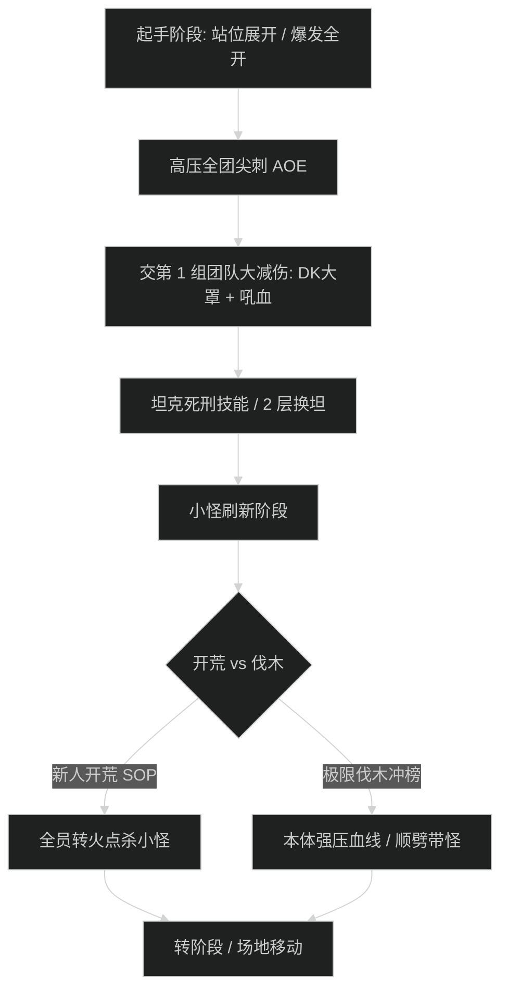

# [首领中文名] 史诗难度攻坚指南

## 1. 战斗流程与时序图

## 2. 核心技能与应对机制

- **全屏灭团技 ([技能名称])**：
  - 首领每 90 秒施放一次，造成全团穿透法术伤害。
  - **应对**：严格按照时间轴交出团队减伤链，治疗提前预铺群抬技能。
- **换坦死刑技能 ([技能名称])**：
  - 造成极高物理穿刺与破甲易伤，叠至 2 层副坦立即嘲讽换坦。
- **环境地板点名 ([技能名称])**：
  - 被点名玩家头顶出现红圈，4 秒内撤离人群至指定边缘场地排火。

## 3. 职责分工表

| 职责 | 核心行动要点 | 关键自保与灭团预警 |
| :--- | :--- | :--- |
| **坦克 (Tank)** | 保持 Boss 面朝场地外围，死刑前覆盖主动硬免伤；小怪刷新时第一时间聚怪接怪。 | 严禁带 Boss 转头顺劈近战人群；换坦必须秒嘲。 |
| **治疗 (Healer)** | AOE 来临前 3 秒展开抬血预铺；关注中点名队员血线并及时驱散负面状态。 | 预留单抬大招（如圣疗术、守护之魂）应对中点名漏开减伤队员。 |
| **输出 (DPS)** | 严格对齐易伤轴开爆发；小怪刷新时按分配优先级转火；规避场地落井地板。 | 严禁贪刀导致地板技能排在近战输出位。 |

## 4. 新人开荒 vs 伐木冲分对照

- **新人开荒策略**：以全员存活为最高优先级。嗜血开在狂暴救急阶段；治疗团队保持 4 治疗配置；全员小怪转火零遗漏。
- **伐木冲分打法**：压缩至 3 治疗，起手全员偷药水交嗜血，利用爆发期将首领血量直接打进转阶段，跳过第二轮小怪召唤。
