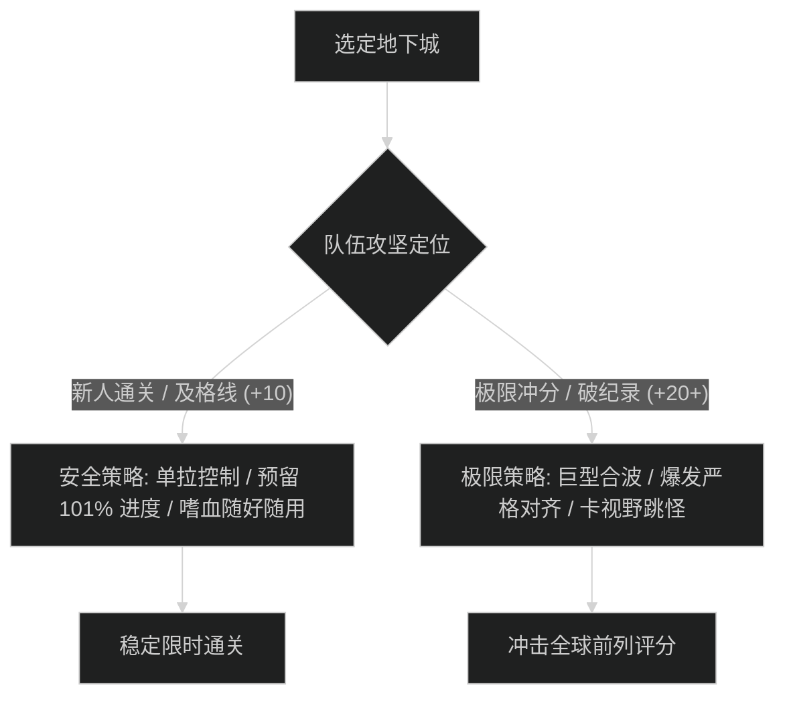

# 大秘境地下城赛季总览与评分体系 (Midnight Season 2)

## 1. 赛季官方大秘境 8 地下城池概览

根据暴雪官方公告《Midnight Season 2 is Now Live》，第二赛季大秘境轮换池采用“5 新本 + 3 经典回归本”格局，限时分布在 30 至 39 分钟之间：

| 地下城名称 | 英文标识 (Slug) | 所属版本 / 类型 | 基础限时 | 核心驱散 / 应对需求 | 攻略直达 |
| :--- | :--- | :--- | :--- | :--- | :--- |
| **夺目谷** | `the-blinding-vale` | 至暗之夜 (新本) | 30:00 (1800s) | 中毒、诅咒驱散 | [查看攻略](./the-blinding-vale/README.md) |
| **密谋小径** | `murder-row` | 至暗之夜 (新本) | 32:00 (1920s) | 魔法驱散、反潜破隐 | [查看攻略](./murder-row/README.md) |
| **纳洛拉克的洞穴** | `den-of-nalorakk` | 至暗之夜 (新本) | 33:00 (1980s) | 激怒驱散 (刚需) | [查看攻略](./den-of-nalorakk/README.md) |
| **毒牙祭坛** | `altar-of-fangs` | 至暗之夜 (新本) | 35:00 (2100s) | 疾病、中毒驱散 | [查看攻略](./altar-of-fangs/README.md) |
| **虚空之痕竞技场** | `voidscar-arena` | 至暗之夜 (新本) | 31:00 (1860s) | 魔法驱散、暗影大减伤 | [查看攻略](./voidscar-arena/README.md) |
| **红玉新生法池** | `ruby-life-pools` | 巨龙时代 (经典回归) | 30:00 (1800s) | 冰霜/火焰魔法驱散 | [查看攻略](./ruby-life-pools/README.md) |
| **诸王之眠** | `kings-rest` | 争霸艾泽拉斯 (经典回归) | 39:00 (2340s) | 中毒驱散、快速开棺救人 | [查看攻略](./kings-rest/README.md) |
| **塞塔里斯神庙** | `temple-of-sethraliss` | 争霸艾泽拉斯 (经典回归) | 35:00 (2100s) | 轮流挡线、背对致盲之沙 | [查看攻略](./temple-of-sethraliss/README.md) |

> **扩展常备地下城**：至暗之夜首发地下城 [晨曦尖塔](./the-dawnspire/README.md)、[阿曼尼地穴](./amani-crypts/README.md)、[运货快道](./freightrunner-run/README.md) 攻略已完整收录，供史诗 0 层周常与后续赛季轮换参考。

---

## 2. 词缀机制与赛季规则

当前基准版本词缀采用 4 级阶梯体系：
- **+2 钥石**：残暴（Tyrannical - 首领生命与伤害提高）与强韧（Fortified - 非首领怪生命与伤害提高）每周交替轮换。
- **+4 钥石**：战术挑战词缀（如虚空畸体、剧毒溃烂），惩罚漏断与走位迟缓。
- **+7 钥石**：压迫强化词缀（如死疽重伤、暴怒），强化坦克减伤与治疗回溯压力。
- **+10 钥石**：至暗之誓（Midnight Covenant）赛季专属词缀，击杀特定带增益小怪可获取全队副属性或移动速度加成。
- **+12 及以上**：词缀数值线性递增，纯考验队伍数值极限与容错。

---

## 3. 大秘境限时评分与装备层级

| 钥石层数 | 限时基础评分 | 掉落装备装等 | 宏伟宝库 (低保) | 核心攻坚意义 |
| :--- | :--- | :--- | :--- | :--- |
| **+7** | ~180 分 | 英雄 1/6 | 英雄 3/6 | 新人起步，熟悉机制走位 |
| **+10** | ~240 分 | 英雄 4/6 | 史诗 1/6 | 解锁全部词缀，低保资格 |
| **+15** | ~290 分 | 史诗 1/6 | 史诗 3/6 | 装备毕业刷取标准线 |
| **+18** | ~330 分 | 史诗 2/6 | 史诗 4/6 | 解锁地下城专属传送门 |
| **+20** | ~370 分 | 史诗 3/6 | 史诗 4/6 | 冲击服务器前列与高分天梯 |
| **+22+** | ~400+ 分 | 史诗 3/6 | 史诗 4/6 | 极限冲榜与世界天梯排名 |

---

## 4. 新人 vs 冲分核心策略矩阵

