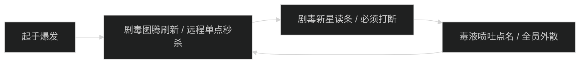
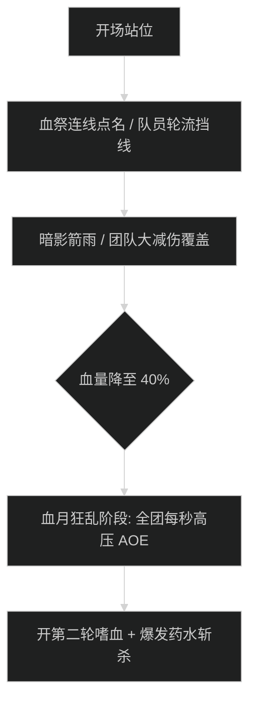

# 毒牙祭坛 (Altar of Fangs) 首领机制与击杀指南

## 1. 1 号首领：剧毒女祭司苏拉 (Venom Priestess Sula)

### 机制时序图

- **剧毒图腾 (Poison Ward)**：每 30 秒刷新 2 根图腾，持续对全团施加可叠加剧毒 Dot。远程必须第一时间秒点图腾。
- **剧毒新星 (Toxic Nova)**：首领 3 秒大读条，全团 60% 自然伤害。近战必须预留打断。

---

## 2. 2 号首领：暴食巨口戈尔莫 (Goremaw the Ravenous)

### 核心技能与胃酸规避
- **反刍胃酸 (Acid Regurgitation)**：
  - 首领对前方 90 度扇形喷射大量胃酸，落地形成永久绿水。坦克必须将首领拉在场地一角，面向外墙，逐步向外挪动。
- **暴食撕咬 (Gorging Bite)**：
  - 坦克死刑技能，造成极高物理穿刺伤害并附加 100% 易伤，持续 12 秒。坦克必须覆盖核心硬减伤（如炽热防御者、符文韧性）。

---

## 3. 3 号尾王：大先知祖尔卡兹 (High Prophet Zul'Kazz)

### 核心机制与血月斩杀时序

- **暗影血祭连线 (Blood Siphon Beam)**：
  - 首领连线 1 名队员引导暗影吸血。未挡线时每秒回复首领 3% 生命值。必须由副坦克或开减伤的近战队员站在中间截断连线（挡线者每秒承受 15 万暗影伤害）。
- **血月狂乱 (Blood Moon Frenzy)**：
  - 首领 40% 血量以下狂暴，伤害提高 50%，全屏每 3 秒施放一次暗影波。全员必须在此阶段交出嗜血与全自保技能，全力斩杀本体。
