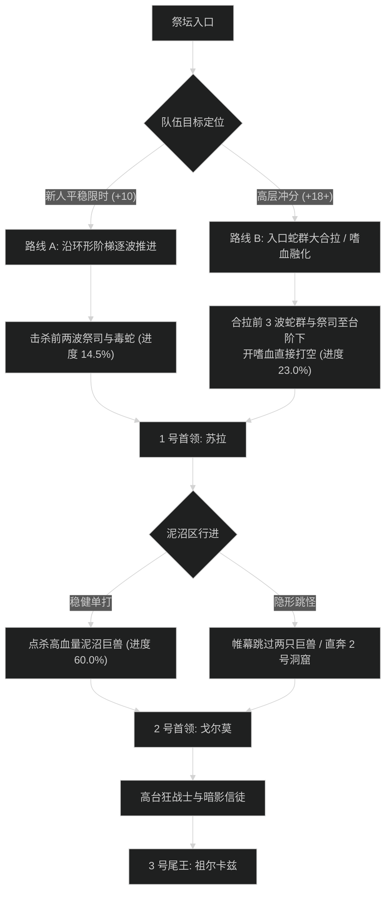

# 毒牙祭坛 (Altar of Fangs) 路线规划与拉怪时序

## 1. 路线决策时序图

---

## 2. 新人平稳推进路线 (+7 至 +12 层)

- **核心原则**：不跨阶梯合怪；优先单点血祭司断其回血；稳扎稳打。
- **目标进度**：击杀尾王前达到 **101.4%**。

### 拉怪波次细节 (Pulls)
1. **Pull 1 (祭坛阶梯)**：祭坛血祭司 x1 + 剧毒蝰蛇 x4。主打断血祭司读条，毒蛇顺劈。进度：6.0%。
2. **Pull 2 (1 号平台外)**：巨魔狂战士 x1 + 蝰蛇 x3。狂战士正面顺劈调转面向。进度：12.5%。
3. **Pull 3 (1 号门前)**：血祭司 x2 + 毒蛇幼崽群。双打断分配，全员开小减伤。进度：19.0%。
4. **1 号首领：苏拉**。打断毒液新星，转火图腾，耗时约 2分25秒。
5. **Pull 4 - Pull 8 (泥沼与蛇坑)**：逐波清理泥沼兽，注意驱散疾病，进度推进至 64.0%。
6. **2 号首领：戈尔莫**。正面吐酸注意横向走位，耗时约 2分50秒。
7. **Pull 9 - Pull 13 (血神高台)**：稳步处理暗影巨魔，进度推至 101.4%。
8. **3 号尾王：大先知祖尔卡兹**。全员轮流挡线，耗时约 3分20秒。

---

## 3. 高层冲分极限合波路线 (+18 至 +22+ 层)

- **核心原则**：开门把前 3 波（包含 2 名血祭司与大量毒蛇）合并拉在台阶下，开嗜血全技能融化；泥沼区利用帷幕跳过 2 只高血量泥沼兽；节省 3 分钟以上给尾王血月阶段。

### 极限合波批次 (Mega-pulls)
1. **合波 1 (入口三波大合拉)**：
   - 包含小怪：祭坛血祭司 x2 + 巨魔狂战士 x1 + 毒蛇 x10（共 13 只）。
   - 战术动作：坦克聚怪于台阶转角，血DK血魔之握聚拢，**开门直接开嗜血**；全队交 2 分钟大招融怪。团队秒伤突破 400 万，进度达到 23.0%。
2. **1 号首领：苏拉**：图腾刷新时由远程单个公 CD 点掉，本体全爆发压制，耗时 1分45秒。
3. **跳怪战术 (泥沼通道)**：
   - 潜行者【暗影帷幕】贴右侧山石穿过，跳过 2 只血量极厚的泥沼漫步巨兽（节省 2 分钟）。
4. **合波 2 (2 号洞窟前广场)**：
   - 合拉两波狂战士与毒蛇，全员控场，进度推进至 76.5%。
5. **2 号首领：戈尔莫**：坦克死刑破甲交大减伤单吃，本体全开，耗时 2分05秒。
6. **合波 3 (尾王祭坛外环)**：合拉暗影狂暴者与信徒，进度锁定在 100.0%。
7. **3 号尾王：祖尔卡兹**：第二轮嗜血在血量 40% 血月狂乱时开启，全员喝爆发药水强行斩杀，耗时 2分40秒。
