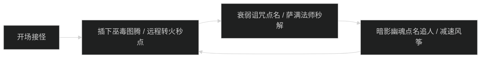
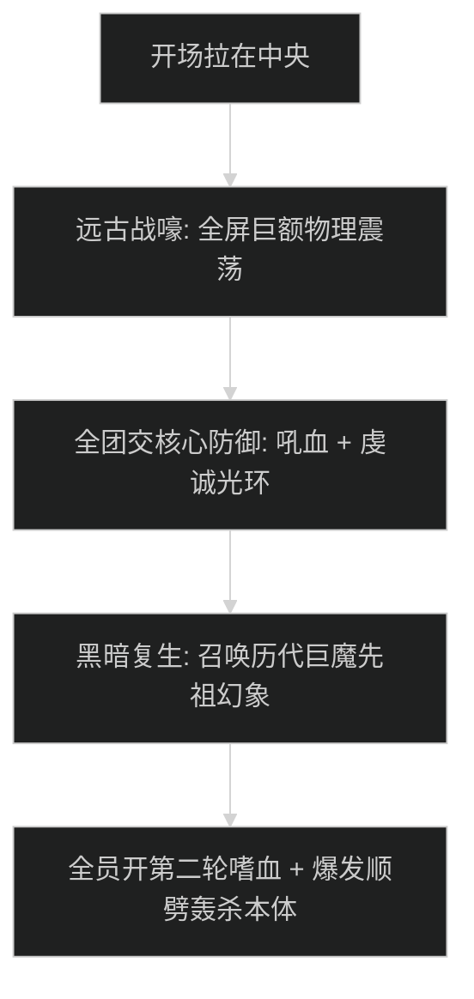

# 阿曼尼地穴 (Amani Crypts) 首领机制与击杀指南

## 1. 1 号首领：巫医特卡拉 (Witch Doctor T'Kala)

### 机制时序图

- **巫毒图腾 (Voodoo Ward)**：首领插下吸收全队属性的图腾，不打掉首领伤害增加 100%。远程必须立即打掉。
- **暗影幽魂 (Shadow Apparition)**：幽魂触碰目标造成自爆秒杀，被点名者外圈风筝，控制技能减速。

---

## 2. 2 号首领：地穴领主马洛尔 (Crypt Lord Malor)

### 核心机制与反伤停手
- **地穴尖刺穿刺 (Crypt Impale)**：
  - 首领将尖刺刺入地面，沿直线追踪队员连续喷发。全员横向移动走位躲避。
- **甲壳硬化反伤 (Spiked Carapace)**：
  - 首领进入 6 秒甲壳硬化状态，受到的 80% 伤害直接反弹给攻击者。
  - **核心操作**：全队输出必须立即按【ESC】取消平砍并停止读条，仅保持坦克仇恨技能。若在此阶段施放爆发大招，直接被自身反伤秒杀。

---

## 3. 3 号尾王：祖阿曼残响 (Zul'Aman Remnant)

### 先祖唤魂与全团狂嚎

- **远古战嚎 (Ancestral Roar)**：
  - 全屏物理大 AOE，造成全员 70% 伤害并使全团恐惧 2 秒。治疗必须在读条前把血线抬满 90% 以上。
- **黑暗复生先祖幻象 (Dark Ancestor Phantoms)**：
  - 刷新 2 名高血量先祖幻象，顺劈本体时顺带处理，全员开嗜血直接轰杀首领本体完成击杀。
