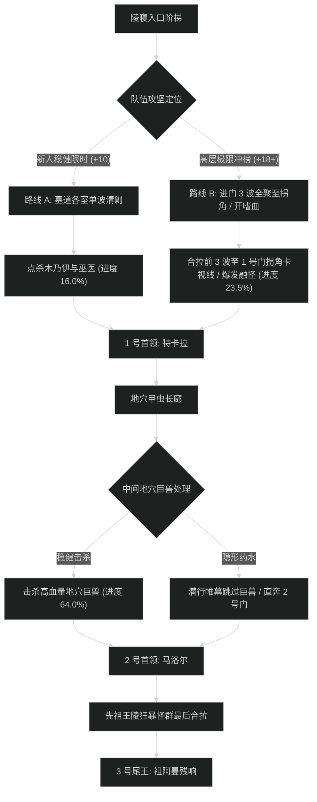

# 阿曼尼地穴 (Amani Crypts) 路线规划与拉怪时序

## 1. 路线决策时序图

---

## 2. 新人平稳推进路线 (+7 至 +12 层)

- **核心原则**：不合拉多只阿曼尼木乃伊（腐烂诅咒致死）；巫医读条巫毒箭优先打断；稳步清怪。
- **目标进度**：击杀尾王前达到 **101.5%**。

### 拉怪波次细节 (Pulls)
1. **Pull 1 (墓道入口)**：阿曼尼木乃伊 x2 + 骷髅战士 x4。解诅咒，顺劈骷髅。进度：5.5%。
2. **Pull 2 (1 号墓室外)**：地穴巫医 x1 + 木乃伊 x2。打断巫医暗影箭，驱散诅咒。进度：11.0%。
3. **Pull 3 (1 号门前)**：巫医 x2 + 骷髅狂暴者 x1。双打断分配，全员开小减伤。进度：17.5%。
4. **1 号首领：特卡拉**。转火图腾，耗时约 2分25秒。
5. **Pull 4 - Pull 8 (地穴甲虫区)**：逐波清理甲虫与地穴编织者，进度推进至 65.0%。
6. **2 号首领：地穴领主马洛尔**。甲壳硬化停手，耗时约 2分45秒。
7. **Pull 9 - Pull 12 (先祖王陵)**：稳步处理先祖巨魔狂魂，进度推至 101.5%。
8. **3 号尾王：祖阿曼残响**。战嚎时全团减伤，耗时约 3分20秒。

---

## 3. 高层冲分极限合波路线 (+18 至 +22+ 层)

- **核心原则**：开门把墓道前 3 波（包含 4 只木乃伊与大量骷髅）全部拉至 1 号门拐弯处卡视野聚怪，开嗜血直接打空；地穴甲虫区利用帷幕跳过 2 只高血量地穴巨兽；节省 3 分钟以上给尾王先祖唤魂阶段。

### 极限合波批次 (Mega-pulls)
1. **合波 1 (开门墓道合拉)**：
   - 包含小怪：地穴巫医 x3 + 阿曼尼木乃伊 x4 + 骷髅群 x10（共 17 只）。
   - 战术动作：坦克骑马向内聚齐，全队在 1 号门内侧柱后集合。**起手交嗜血**；萨满电能图腾配合圣骑盲目之光覆盖起手读条。团队秒伤突破 420 万，进度达到 23.5%。
2. **1 号首领：特卡拉**：图腾刷新远程瞬秒，主目标死压本体，耗时 1分40秒。
3. **跳怪战术 (地穴通道)**：
   - 潜行者【暗影帷幕】贴右侧墙疾跑穿过，跳过 2 只血量极厚的地穴巨兽（节省 2 分钟）。
4. **合波 2 (2 号门前大厅)**：
   - 合拉两波甲虫与编织者，全员群晕秒杀，进度推进至 77.0%。
5. **2 号首领：马洛尔**：反伤阶段全员停手仅挂平砍，反伤一过全爆发药水轰杀，耗时 2分00秒。
6. **合波 3 (王陵廊道)**：合拉最后两波巨魔狂魂，进度精确达到 100.0%。
7. **3 号尾王：祖阿曼残响**：第二轮嗜血在召唤先祖幻影时开启，全员爆发顺劈双目标轰杀本体，耗时 2分35秒。
