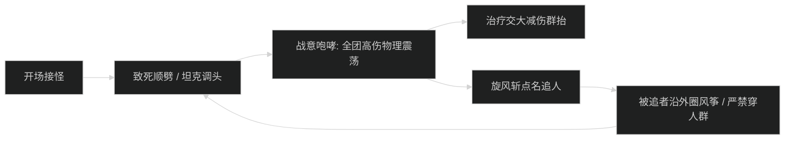
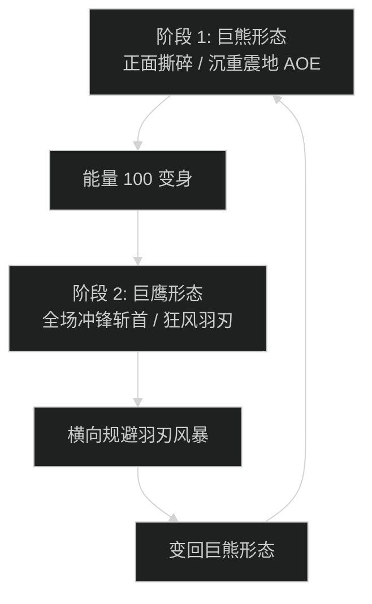

# 纳洛拉克的洞穴 (Den of Nalorakk) 首领机制与击杀指南

## 1. 1 号首领：战帅托格 (Warleader Torg)

### 机制流程图

### 核心技能与灭团点
- **致死顺劈 (Mortal Cleave)**：
  - 正面 120 度扇形重劈，造成极高物理直伤并降低受治疗效果 50%。坦克必须将首领面向背对全队，且在读条时开启核心硬减伤。
- **狂怒旋风 (Furious Whirlwind)**：
  - 首领锁定 1 名远离的队员移动旋转，触碰者每秒承受 25 万物理伤害。被锁定者沿边缘风筝，近战全部拉开距离。

---

## 2. 2 号首领：巨熊始祖 (Ursine Patriarch)

### 核心机制
- **重伤撕咬 (Grievous Bite)**：
  - 坦克死刑技能，造成持续 15 秒巨额流血，层数可叠至 3 层。
  - **对策**：圣骑士可通过【保护祝福】或【无敌】直接清除流血层数；死亡骑士需交【冰封之韧】或【符文韧性】配合灵界打击回溯。
- **大地粉碎 (Earth Crush)**：
  - 首领跃起重踏地面，全场落石。队员必须在落石红圈落地前向安全空隙走位。

---

## 3. 3 号尾王：纳洛拉克化身 (Avatar of Nalorakk)

### 核心双形态交替循环

- **巨熊形态 (Bear Form)**：
  - 狂暴物理平砍压力极大。坦克必须全程保持盾击或骨盾不断档。首领施放【沉重震地】时，全队集合在治疗身边开启微型减伤。
- **巨鹰形态 (Hawk Form)**：
  - 首领上天并对点名队员进行直线冲锋，留下狂风路径。被点名者需保持静止，其余队员迅速离开冲锋连线。
- **极限冲分压阶段**：
  - 冲分队伍起手留爆发，等待首领从巨鹰形态变回巨熊形态时开启嗜血与全爆发药水，在首领第二次变身前将其压死。
