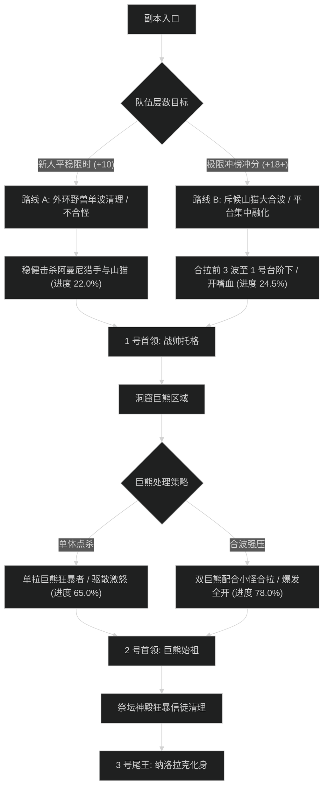

# 纳洛拉克的洞穴 (Den of Nalorakk) 路线规划与拉怪时序

## 1. 路线决策时序图

---

## 2. 新人平稳推进路线 (+7 至 +12 层)

- **核心原则**：严禁多拉狂暴者；遇到战鹰斥候必须优先单点击杀；巨熊狂暴者单拉处理。
- **目标进度**：击杀尾王前达到 **101.5%**。

### 拉怪波次细节 (Pulls)
1. **Pull 1 (入口外环)**：阿曼尼猎手 x2 + 战鹰斥候 x1。起手给斥候单晕，阻止其读条召援。进度：4.0%。
2. **Pull 2 (树丛)**：山猫潜伏者 x3 + 猎犬 x2。平稳 AOE，近战躲避山猫正面扑击。进度：8.5%。
3. **Pull 3 (1 号台阶)**：阿曼尼狂战士 x2 + 斥候 x1。激怒时由猎人或德鲁伊驱散，坦克后退风筝。进度：16.0%。
4. **1 号首领：战帅托格**。旋风斩全员后撤，耗时约 2分20秒。
5. **Pull 4 - Pull 7 (洞窟区)**：单拉巨熊狂暴者，坦克在撕裂叠加至 6 层时交大减伤。进度推至 68.0%。
6. **2 号首领：巨熊始祖**。击杀耗时约 2分40秒。
7. **Pull 8 - Pull 11 (神殿高阶)**：清理残余狂暴者与祭司，进度推至 101.5%。
8. **3 号尾王：纳洛拉克化身**。耗时约 3分10秒，稳妥限时。

---

## 3. 高层冲分极限合波路线 (+18 至 +22+ 层)

- **核心原则**：开门利用群握将前 3 波（包含山猫与斥候）聚在 1 号台阶下，开嗜血直接打空；洞窟内将 2 只巨熊狂暴者合并在同一波小怪中，依靠近战晕眩链强压；总耗时压制在 25 分钟内。

### 极限合波批次 (Mega-pulls)
1. **合波 1 (入口开门波)**：
   - 包含小怪：阿曼尼猎手 x3 + 斥候 x2 + 山猫 x5（共 10 只）。
   - 战术动作：全员开门直接交**嗜血**与全爆发；萨满电能图腾、圣骑盲目之光严格覆盖前 4 秒，防止斥候鸣叫。团队瞬时 DPS 突破 400 万，进度达到 24.5%。
2. **1 号首领：托格**：纯单体压制，首领战斗时间控制在 1分45秒以内。
3. **合波 2 (巨熊洞穴入口)**：
   - 包含小怪：巨熊狂暴者 x1 + 洞穴蝙蝠群（10只）+ 祭司 x2。
   - 战术动作：主目标死压狂暴者，蝙蝠作为顺劈资源点。蝙蝠残血时由治疗开大减伤覆盖全团流血。进度达到 68.5%。
4. **2 号首领：巨熊始祖**：坦克死刑流血依靠保护祝福强行清除，减少治疗读条负担，耗时 2分05秒。
5. **合波 3 (祭坛通道)**：合拉神殿守卫与祭司，进度精确达到 100.0%。
6. **3 号尾王：纳洛拉克化身**：转阶段前全员留技能，巨鹰形态下全团大招嗜血斩杀，耗时 2分30秒。
