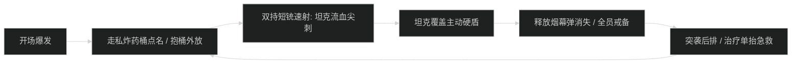
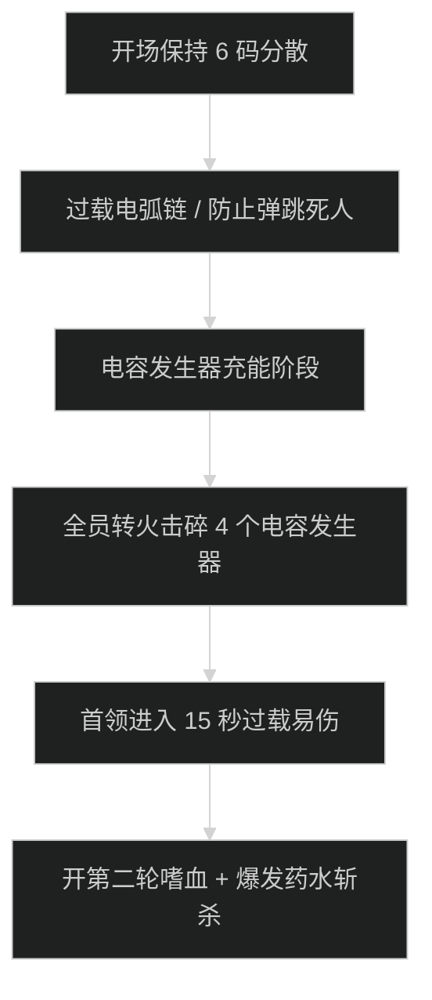

# 运货快道 (Freightrunner's Run) 首领机制与击杀指南

## 1. 1 号首领：走私女王维萨 (Smuggler Queen Veesa)

### 机制时序图

- **走私炸药桶 (Smuggled Powder Keg)**：
  - 首领向场内投掷炸药桶，5 秒后自爆。被点名队员必须右键拾取炸药桶并向场地边缘搬运放下，严禁在首领脚下引爆。
- **烟幕伏击 (Smoke Screen Ambush)**：
  - 首领消失并对随机队员伏击，治疗预留单抬大招（如圣疗、天籁）。

---

## 2. 2 号首领：铁甲无畏号 (Ironbound Dreadnought)

### 核心机制与超载过热
- **蒸汽重击 (Steam Slam)**：
  - 坦克死刑技能，造成极高物理穿透并击退 15 码。坦克必须背靠机甲仓库大门站位。
- **超载过热 (Overload Meltdown)**：
  - 首领能量达到 100 引导全屏火焰风暴，持续 8 秒全团大掉血。全员开启个人硬减伤，治疗交出核心群抬大招。

---

## 3. 3 号尾王：过载者格博 (Overcharger Gebbo)

### 电弧链与电容发生器斩杀时序

- **过载电弧链 (Overloaded Arc Chain)**：
  - 随机向队员发射闪电链，若队员之间距离小于 6 码，电弧伤害翻倍弹跳。全员必须保持严格分散。
- **电容发生器易伤 (Capacitor Vulnerability)**：
  - 发生器刷新后全队必须以最快速度将其击破。击破后首领陷入虚弱易伤 50%，全员在此窗口期开启嗜血与全爆发斩杀。
