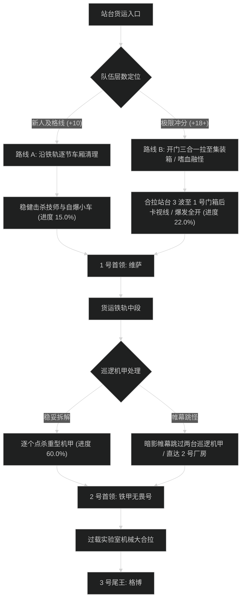

# 运货快道 (Freightrunner's Run) 路线规划与拉怪时序

## 1. 路线决策时序图

---

## 2. 新人平稳推进路线 (+7 至 +12 层)

- **核心原则**：遇到自爆车必须先交减速或单晕点杀，严禁让自爆车靠近近战堆；打断技师修理。
- **目标进度**：击杀尾王前达到 **101.5%**。

### 拉怪波次细节 (Pulls)
1. **Pull 1 (站台进门)**：地精技师 x2 + 铁甲监工 x1。打断修理扳手，监工顺劈调面向。进度：5.0%。
2. **Pull 2 (货厢旁)**：自爆小车 x3 + 技师 x1。给自爆车地缚/减速，远程单点。进度：10.5%。
3. **Pull 3 (1 号门外)**：监工 x2 + 技师 x2。双打断分配，全员开小减伤。进度：16.5%。
4. **1 号首领：走私女王维萨**。炸药桶贴边放置，耗时约 2分15秒。
5. **Pull 4 - Pull 8 (机甲修理厂)**：逐波清理机甲与装配工，进度推进至 62.0%。
6. **2 号首领：铁甲无畏号**。超载过热交减伤，耗时约 2分35秒。
7. **Pull 9 - Pull 12 (发电机车间)**：稳步处理机械守卫，进度推至 101.5%。
8. **3 号尾王：过载者格博**。转火发电机，耗时约 3分00秒。

---

## 3. 高层冲分极限合波路线 (+18 至 +22+ 层)

- **核心原则**：开门把站台前 3 波（包含 6 名技师与自爆车）全部拖至 1 号门侧集装箱后卡视野聚怪，开嗜血直接打空；中间利用帷幕跳过 2 台重型巡逻机甲；节省 3 分钟以上给尾王电容过载阶段。

### 极限合波批次 (Mega-pulls)
1. **合波 1 (站台开门合拉)**：
   - 包含小怪：地精技师 x4 + 铁甲监工 x2 + 自爆车 x6（共 12 只）。
   - 战术动作：坦克骑马向内聚齐，全队在 1 号门内侧集装箱后集合。**起手交嗜血**；萨满电能图腾配合圣骑盲目之光覆盖起手，武器战旋风斩+邪DK血兽瞬间蒸发自爆车。团队秒伤突破 420 万，进度达到 22.0%。
2. **1 号首领：维萨**：炸药桶由副坦单独拉开，本体死压，耗时 1分40秒。
3. **跳怪战术 (修理厂轨道)**：
   - 潜行者【暗影帷幕】贴左侧轨道疾跑穿过，跳过 2 台血量极厚的重型机甲（节省 1分50秒）。
4. **合波 2 (2 号门前广场)**：
   - 合拉两波监工与机械警犬，全员群晕秒杀，进度推进至 75.5%。
5. **2 号首领：铁甲无畏号**：超载过热阶段奶骑交美德道标大招强刷，全员嗑爆发药水压死，耗时 1分55秒。
6. **合波 3 (发电机廊道)**：合拉最后两波机械守卫，进度精确达到 100.0%。
7. **3 号尾王：格博**：第二轮嗜血在电容发生器刷新时开启，全员爆发顺劈双目标轰杀本体，耗时 2分20秒。总耗时锁定在 24 分钟以内。
