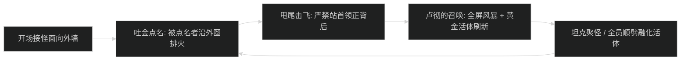
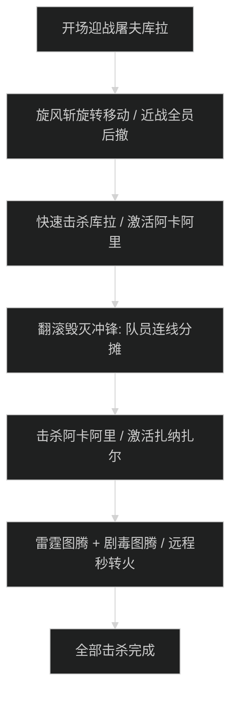

# 诸王之眠 (Kings' Rest) 首领机制与击杀指南

## 1. 1 号首领：黄金风蛇 (The Golden Serpent)

### 机制时序图

- **吐金 (Spit Gold)**：随机点名队员，持续大掉血并在脚下留下金色水池。被点名者贴外墙跑位。
- **卢彻的召唤 (Lu'pa's Call)**：全屏风暴 AOE，治疗交群体大招。顺劈小怪防止首领吸收回血。

---

## 2. 2 号首领：殓尸者姆沁巴 (Mchimba the Embalmer)

### 核心机制与开棺救人
- **石棺埋葬 (Entomb)**：
  - 首领随机将 1 名队员关入场地 4 个石棺之一，被困者持续受暗影流血且无法行动。
  - **救人动作**：其余队员必须观察 4 个石棺，**仅点击有剧烈晃动、冒黑烟的石棺**。点对立即救出队友；点错石棺则释放出额外的木乃伊守卫引发场面混乱。
- **干尸枯萎 (Drain Fluids)**：
  - 坦克死刑引导技能，治疗必须全力单抬，坦克覆盖主动硬减伤。

---

## 3. 3 号首领：部族议会 (The Council of Tribes)

### 核心轮换与图腾转火

- **屠夫库拉**：旋风斩全场移动，近战严禁贴脸。
- **征服者阿卡阿里**：点名队员锁定冲锋，必须有 2 名以上队友站在路径上分摊物理伤害。
- **智者扎纳扎尔**：插下雷霆图腾与剧毒图腾，远程必须第一时间秒点图腾。

---

## 4. 4 号尾王：达萨，始祖之王 (Dazar, The First King)

- **剑刃风暴 (Blade Combo)**：四连击物理死刑，坦克必须开启【远古列王守卫】或【冰封之韧】。
- **猎头飞矛 (Gale Slash)**：点名后排投掷飞矛，被点名者远离人群，避免龙卷风封锁场地。
- **风蛇战宠斩杀**：血量 80% 与 50% 分别召唤雷霆风蛇与猎犬战宠，全队顺劈压本体，开第二轮嗜血斩杀。
