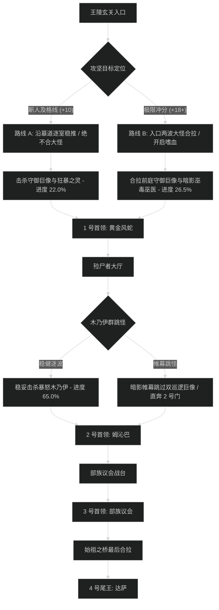

# 诸王之眠 (Kings' Rest) 路线规划与拉怪时序

## 1. 路线决策时序图

---

## 2. 新人平稳推进路线 (+7 至 +12 层)

- **核心原则**：严禁同时拉 2 只暗影巫毒狂暴者；遇到剧毒小软必须远程先击杀；石棺开人需有专人负责。
- **目标进度**：击杀尾王前达到 **101.5%**。

### 拉怪波次细节 (Pulls)
1. **Pull 1 (王陵门厅)**：守御巨像 x1 + 黄金侍从 x2。躲避巨像正面重砸，平稳击杀。进度：5.5%。
2. **Pull 2 (通廊阶梯)**：暗影巫医 x1 + 狂暴之灵 x1。必须分配打断巫医暗影箭。进度：12.5%。
3. **Pull 3 (1 号门外)**：巨像 x1 + 巫医 x1。双打断分配，全员开小减伤。进度：22.0%。
4. **1 号首领：黄金风蛇**。吐金排在场地外圈，顺劈黄金活体，耗时约 2分30秒。
5. **Pull 4 - Pull 8 (石棺长廊)**：逐波清理复生木乃伊与毒软，注意解毒，进度推进至 66.0%。
6. **2 号首领：殓尸者姆沁巴**。石棺晃动时迅速右键救人，耗时约 2分40秒。
7. **Pull 9 - Pull 11 (部族战台前)**：稳步处理部族守卫，进度达到 82.0%。
8. **3 号首领：部族议会**。依次集火，转火图腾，耗时约 3分00秒。
9. **Pull 12 (始祖桥)**：清理最后巡逻守卫，进度达到 101.5%。
10. **4 号尾王：达萨，始祖之王**。躲开剑刃风暴，打断猎头者飞矛，耗时约 3分20秒。

---

## 3. 高层冲分极限合波路线 (+18 至 +22+ 层)

- **核心原则**：开门把前庭 2 只巨像与巫医合并拉进 1 号门内拐角卡视野聚怪，开嗜血直接打穿；石棺区利用帷幕跳过 2 只高血量巡逻巨像；节省 4 分钟给 3 号议会与尾王。

### 极限合波批次 (Mega-pulls)
1. **合波 1 (开门大合波)**：
   - 包含小怪：守御巨像 x2 + 暗影巫医 x2 + 侍从 x4（共 8 只）。
   - 战术动作：坦克聚怪于 1 号门内拐角，**起手直接交嗜血**；萨满电能图腾配合圣骑盲目之光打断起手读条。团队秒伤突破 410 万，进度达到 26.5%。
2. **1 号首领：黄金风蛇**：纯单体压制，首领战斗时间控制在 1分45秒以内。
3. **跳怪战术 (石棺走廊)**：
   - 潜行者【暗影帷幕】穿过，绕过 2 只血厚单体守御巨像（节省 2 分钟）。
4. **合波 2 (2 号门前大厅)**：
   - 合拉两波木乃伊与巫医，全员群晕秒杀，进度推进至 76.0%。
5. **2 号首领：姆沁巴**：点名进棺后由移动速度最快的队员秒点开棺，全爆发轰杀，耗时 1分50秒。
6. **3 号首领：部族议会**：屠夫旋风斩时近战后撤，法系开大招快速单点斩杀，耗时 2分15秒。
7. **合波 3 (始祖大桥)**：合拉桥头怪物，进度精确达到 100.0%。
8. **4 号尾王：达萨**：第二轮嗜血在风蛇战宠召唤时开启，顺劈双目标轰杀本体，耗时 2分30秒。
