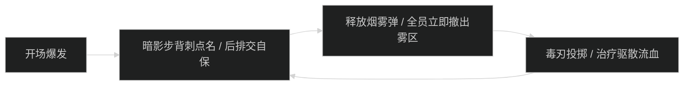
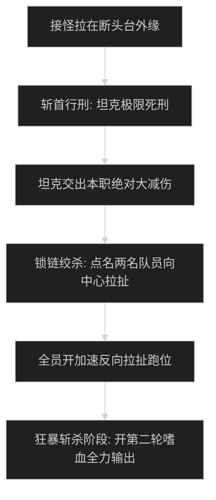

# 密谋小径 (Murder Row) 首领机制与击杀指南

## 1. 1 号首领：夜行者里克丝 (Nightstalker Rix)

### 机制流程图

- **烟雾弹 (Smoke Bomb)**：
  - 首领施放后在地面留下一片巨大黑雾，身处其中的队员无法释放法术且每秒受到暗影伤害。全员必须第一时间翻滚或位移撤离雾区。
- **暗影步伏击 (Shadowstep Ambush)**：
  - 首领瞬移至最远距离队员背后造成巨额穿刺伤。布甲队员需开启个人硬免伤。

---

## 2. 2 号首领：暗谷男爵 (Baron von Shadowglen)

### 核心技能与破盾时序
- **灵魂榨取护盾 (Soul Siphon Barrier)**：
  - 首领引导 8 秒吸取全队生命，期间获得 600 万点暗影护盾。若 8 秒内未打破护盾，首领引爆造成全团秒杀。
  - **对策**：全队必须预留爆发技能与药水，在护盾出现瞬间集火击碎，并立即打断其吸血引导。
- **吸血蝙蝠群 (Swarm of Bats)**：
  - 伴随首领召唤的顺劈怪，由坦克拉紧在首领身边，利用近战 AOE 顺带击杀。

---

## 3. 3 号尾王：刽子手韦恩 (Executioner Vane)

### 核心机制与极限压阶段

- **斩首行刑 (Decapitation Strike)**：
  - 造成极度夸张的物理直伤（+20 层高达 210 万物理伤害）。坦克必须覆盖【炽热防御者+远古列王守卫】或【符文韧性+吸血鬼之血】，严禁任何侥幸裸吃。
- **锁链绞杀 (Chains of Execution)**：
  - 首领向场内两名队员发射锁链，并快速将他们拉向场地中央的断头台切片。被点名者必须开启疾跑、消散或自由祝福全力向反方向拉开。
- **狂暴斩杀**：
  - 首领 30% 血量以下平砍速度提高 60%，全队开嗜血直接顶脸斩杀。
