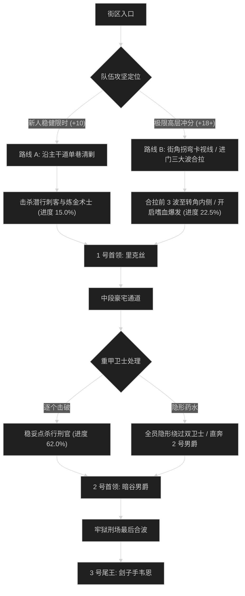

# 密谋小径 (Murder Row) 路线规划与拉怪时序

## 1. 路线决策时序图

---

## 2. 新人平稳推进路线 (+7 至 +12 层)

- **核心原则**：严禁脸探房檐转角（房顶有潜行刺客）；炼金术士酸液瓶第一时间走位避开；不跨街区拉怪。
- **目标进度**：击杀尾王前达到 **101.5%**。

### 拉怪波次细节 (Pulls)
1. **Pull 1 (街口)**：巷道刺客 x2 + 炼金术士 x1。打断酸液瓶，击杀刺客。进度：4.5%。
2. **Pull 2 (拐角)**：重甲行刑官 x1 + 刺客 x2。行刑官正面震荡近战走开。进度：10.5%。
3. **Pull 3 (1 号广场门外)**：炼金术士 x2 + 暗影刺客 x3。全员开小减伤。进度：17.0%。
4. **1 号首领：夜行者里克丝**。烟雾弹迅速撤离，耗时约 2分10秒。
5. **Pull 4 - Pull 8 (豪宅区走廊)**：逐波清理暗影信徒与恶犬，进度推进至 62.0%。
6. **2 号首领：暗谷男爵**。破盾打断灵魂榨取，耗时约 2分30秒。
7. **Pull 9 - Pull 12 (刑场牢房)**：稳步推进，打断行刑手，进度达到 101.5%。
8. **3 号尾王：刽子手韦恩**。被锁链拉拽时迅速后撤，耗时约 3分10秒。

---

## 3. 高层冲分极限合波路线 (+18 至 +22+ 层)

- **核心原则**：开门把前 3 波（包含 6 名刺客与 3 名炼金术士）全部拖至 1 号门内侧拐角卡视野聚怪，开嗜血直接打空；豪宅区利用隐形药水跳过 2 只高血量行刑官；节省 3 分钟以上给尾王斩首死刑阶段。

### 极限合波批次 (Mega-pulls)
1. **合波 1 (入口拐弯大合拉)**：
   - 包含小怪：巷道刺客 x6 + 剧毒炼金术士 x3 + 卫士 x1（共 10 只）。
   - 战术动作：坦克骑马吸引仇恨，全队在 1 号广场转角贴墙，迫使所有远程怪聚齐。
   - 技能分配：**起手交嗜血** + 全员 2 分钟大招；圣骑盲目之光覆盖全场酸液瓶读条。队伍秒伤峰值达到 430 万，进度达到 22.5%。
2. **1 号首领：里克丝**：纯单体压制，首领战斗时间压进 1分35秒。
3. **跳怪战术 (豪宅长廊)**：
   - 全队使用【次级隐形药水】贴左侧花坛疾跑，绕过 2 只重甲行刑官（节省 1分40秒单体木桩时间）。
4. **合波 2 (2 号男爵门前平台)**：
   - 合拉蝙蝠群与暗影信徒，利用萨莱茵血兽或武器战顺劈瞬间融化，进度推进至 75.0%。
5. **2 号首领：暗谷男爵**：全员爆发药水留给破盾阶段，8 秒内打掉 600 万护盾，耗时 1分50秒。
6. **合波 3 (刑场牢廊)**：合拉最后两波刺客，进度精确锁定在 100.0%。
7. **3 号尾王：刽子手韦恩**：第二轮嗜血在首领斩杀期释放，全员嗑爆发药水强杀，耗时 2分20秒。总耗时压进 25 分钟。
