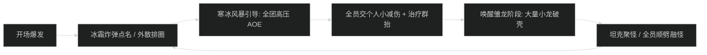
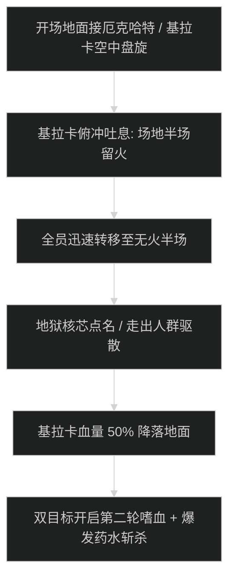

# 红玉新生法池 (Ruby Life Pools) 首领机制与击杀指南

## 1. 1 号首领：梅莉杜莎·寒妆 (Melidrussa Chillworn)

### 机制时序图

- **寒冰风暴 (Chillstorm)**：全屏冰霜狂风，将全队向中心拉扯并在脚下生成冰圈。全员向外走位对抗吸力。
- **唤醒雏龙 (Awaken Whelps)**：血量 75% 与 45% 召唤雏龙，必须由坦克第一时间聚怪，近战顺劈带走。

---

## 2. 2 号首领：柯姬雅·焰蹄 (Kokia Blazehoof)

### 核心技能与熔火巨石
- **熔火巨石 (Molten Boulder)**：
  - 首领锁定 1 名远离的队员投掷巨大滚石，沿直线向前碾压。被点名者向场地外墙边缘走位，其余队员严禁站在滚石路径上。
- **灼热打击 (Searing Blows)**：
  - 坦克死刑连击，造成巨额物理伤害并叠加高额火焰流血。坦克必须开启主动大减伤。

---

## 3. 3 号尾王：基拉卡与厄克哈特·风脉 (Kyrakka & Erkhart Stormvein)

### 双目标战斗与吐息走位

- **地狱核芯 (Inferno Core)**：
  - 随机点名 2 名队员，5 秒后引爆并留下火池。治疗需等待中点名者跑出人群 8 码后再驱散，防止火池排在人群脚下。
- **降落斩杀时序**：
  - 飞龙基拉卡血量被打至 50% 降落地面。全队开第二轮嗜血与爆发药水，优先压死飞龙基拉卡，再击杀厄克哈特。
