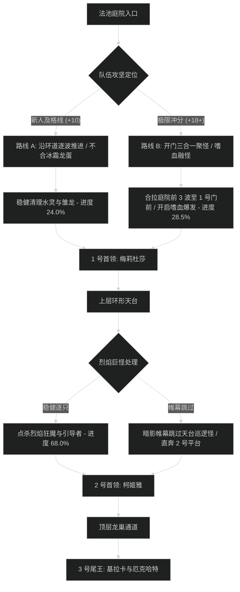

# 红玉新生法池 (Ruby Life Pools) 路线规划与拉怪时序

## 1. 路线决策时序图

---

## 2. 新人平稳推进路线 (+7 至 +12 层)

- **核心原则**：严禁踩破冰霜龙蛋；天台火元素风暴怪物必须单只击杀；打断暴风雪读条。
- **目标进度**：击杀尾王前达到 **101.5%**。

### 拉怪波次细节 (Pulls)
1. **Pull 1 (进门前庭)**：注能水灵 x1 + 拜荒者护卫 x2。打断水灵冰箭，注意躲开冰霜震荡。进度：6.0%。
2. **Pull 2 (法池台阶)**：寒霜唤灵师 x1 + 幼龙 x3。盯紧唤灵师暴风雪读条，秒断。进度：13.5%。
3. **Pull 3 (1 号门外)**：水灵 x1 + 唤灵师 x1。双目标打断分配，全员开小减伤。进度：22.0%。
4. **1 号首领：梅莉杜莎·寒妆**。唤醒雏龙时全力顺劈，耗时约 2分15秒。
5. **Pull 4 - Pull 8 (天台回廊)**：逐波清理烈焰引导者，注意打断火球术，进度推进至 68.0%。
6. **2 号首领：柯姬雅·焰蹄**。巨石点名向场外跑，耗时约 2分30秒。
7. **Pull 9 - Pull 12 (顶层飞龙走廊)**：稳步处理雷霆幼龙，进度推至 101.5%。
8. **3 号尾王：基拉卡与厄克哈特**。躲避地面烈焰吐息，耗时约 2分50秒。

---

## 3. 高层冲分极限合波路线 (+18 至 +22+ 层)

- **核心原则**：开门把前庭 3 波怪（包含 2 只水灵与 2 名唤灵师）全部拉进 1 号门内侧卡视野聚怪，开嗜血直接打穿；天台利用帷幕跳过 2 只高血量烈焰巡逻怪；时间压缩至 23 分钟以内。

### 极限合波批次 (Mega-pulls)
1. **合波 1 (开门大聚怪)**：
   - 包含小怪：注能水灵 x2 + 寒霜唤灵师 x2 + 护卫 x4（共 8 只）。
   - 战术动作：坦克骑马向内聚齐，全队在 1 号门柱后集合。**起手交嗜血**；萨满电能图腾配合圣骑盲目之光覆盖起手双暴风雪读条。团队秒伤突破 430 万，进度达到 28.5%。
2. **1 号首领：梅莉杜莎**：全员小技能压制，首领战时间压进 1分40秒以内。
3. **跳怪战术 (天台走廊)**：
   - 潜行者【暗影帷幕】穿过，绕过 2 只血量极厚的烈焰元素（节省 1分45秒单体时间）。
4. **合波 2 (2 号门前平台)**：
   - 合拉烈焰引导者与炎缚小怪，全员群晕秒杀，进度推进至 78.0%。
5. **2 号首领：柯姬雅**：全员爆发药水压制，召唤的火风暴由副坦拉开顺劈，耗时 1分50秒。
6. **合波 3 (顶层走廊)**：合拉最后两波幼龙，进度精确达到 100.0%。
7. **3 号尾王：双目标战**：第二轮嗜血在厄克哈特降落时开启，双目标双线挂 DoT 顺劈压死，耗时 2分15秒。
