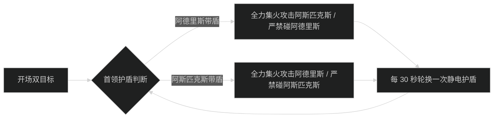
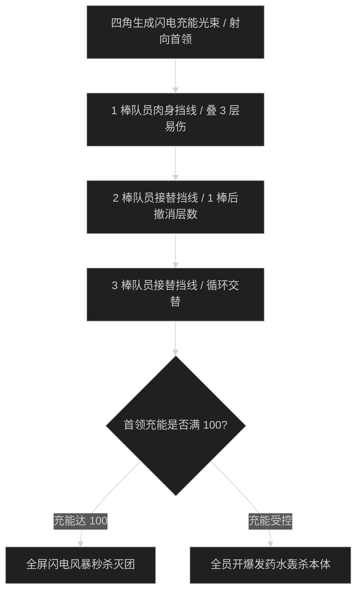

# 塞塔里斯神庙 (Temple of Sethraliss) 首领机制与击杀指南

## 1. 1 号首领：阿德里斯和阿斯匹克斯 (Adderis & Aspix)

### 机制流程图

- **静电之盾 (Shield of Lightning)**：
  - 拥有护盾的首领受到任何伤害（包含 DoT、顺劈、平砍）时，立即对全团反弹 60 万闪电伤害。**全员必须严格单体打无盾目标**。
- **疾风穿刺 (Gale Force)**：坦克死刑技能，读条结束前坦克必须覆盖硬减伤。

---

## 2. 2 号首领：米利克萨 (Merektha)

### 核心技能与盲目之沙
- **盲目之沙 (Blinding Sands)**：
  - 首领读条 2.5 秒，读条结束时对正面所有面向首领的目标造成永久致盲 6 秒。
  - **应对动作**：读条 2 秒时全员必须立即按【向后转】或反向移动，**背对首领**，直到施法特效结束再转回输出。
- **缠绕毒蛇结 (Knot of Snakes)**：
  - 随机缠绕 1 名队员使其昏迷并窒息大掉血。其余输出必须以最快速度将其击破救出队友。

---

## 3. 3 号首领：加瓦兹特 (Galvazzt)

### 闪电充能线与轮流挡线时序

- **充能光束 (Charge Core)**：
  - 光束直射首领每秒增加 5 点能量。必须由玩家站在光束路径上拦截。挡线者每秒受到自然伤害并叠 1 层易伤。
  - **轮换规则**：每人挡线承受 3 次跳血（叠至 3 层）必须立刻跨步走开，由下一名满血队员接手，严禁单人硬抗 5 层以上。

---

## 4. 4 号尾王：塞塔里斯的化身 (Avatar of Sethraliss)

- **纯治疗拯救战 (Healing Encounter)**：
  - 首领为友方 NPC，初始血量为 0%。治疗团队使用全部单抬与群抬大招将其刷至 100% 即可通关。
  - **DPS 与坦克职责**：迅速聚怪击杀刷新的腐化巫妖，打断其【瘟疫吐息】；给跳入场地的毒蛙挂减速，严禁毒蛙靠近化身降低受治疗效果。
  - **嗜血开启时机**：起手直接开嗜血，治疗全开爆发饰品与药水，在两轮巫妖刷新前直接将化身刷满获胜。
