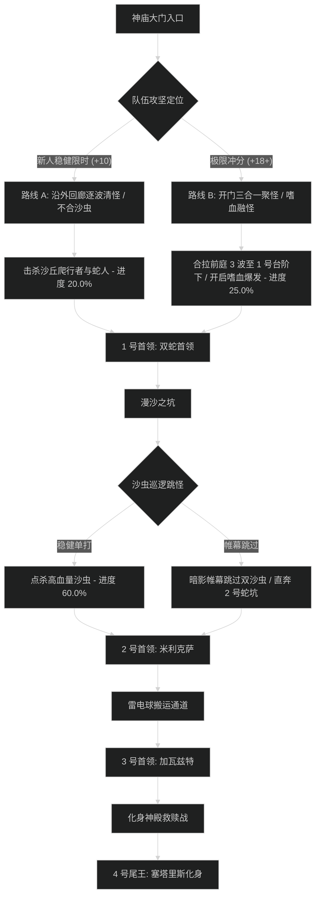

# 塞塔里斯神庙 (Temple of Sethraliss) 路线规划与拉怪时序

## 1. 路线决策时序图

---

## 2. 新人平稳推进路线 (+7 至 +12 层)

- **核心原则**：严禁打带盾的目标；米利克萨盲目之沙必须背对；加瓦兹特安排严格轮换挡线。
- **目标进度**：击杀尾王前达到 **101.5%**。

### 拉怪波次细节 (Pulls)
1. **Pull 1 (进门前庭)**：无信者前锋 x2 + 驯蛇者 x1。打断驯蛇者毒箭，顺劈小蛇。进度：5.5%。
2. **Pull 2 (神庙阶梯)**：蛇人法师 x1 + 前锋 x2。打断闪电箭，集火击杀。进度：12.0%。
3. **Pull 3 (1 号门外)**：法师 x2 + 驯蛇者 x1。双打断分配，全员开小减伤。进度：20.0%。
4. **1 号首领：阿德里斯和阿斯匹克斯**。转火无盾目标，耗时约 2分20秒。
5. **Pull 4 - Pull 8 (沙坑区)**：逐波清理沙虫与潜伏小蛇，进度推进至 62.0%。
6. **2 号首领：米利克萨**。背对致盲之沙，快速打碎缠绕毒蛇，耗时约 2分40秒。
7. **Pull 9 - Pull 10 (雷电长廊)**：双人搬运雷电之球塞入蛇口大门，进度达到 80.0%。
8. **3 号首领：加瓦兹特**。全员轮流挡线，耗时约 2分30秒。
9. **Pull 11 (化身殿堂前)**：清理腐化守护者，进度达到 101.5%。
10. **4 号尾王：塞塔里斯的化身**。控场青蛙，打断巫妖，治疗全力刷满化身，耗时约 2分45秒。

---

## 3. 高层冲分极限合波路线 (+18 至 +22+ 层)

- **核心原则**：开门把前庭 3 波全部拉进 1 号门内拐角卡视野聚怪，开嗜血直接打穿；沙坑区利用帷幕跳过 2 只高血量沙虫；雷电球由高机动性职业（小德/猎人）秒送进门；节省 4 分钟给加瓦兹特与化身。

### 极限合波批次 (Mega-pulls)
1. **合波 1 (开门大聚怪)**：
   - 包含小怪：蛇人法师 x3 + 无信者前锋 x4 + 小蛇群 x10（共 17 只）。
   - 战术动作：坦克聚怪于 1 号门台阶下，**起手直接交嗜血**；萨满电能图腾配合圣骑盲目之光打断起手全部闪电箭。团队秒伤突破 420 万，进度达到 25.0%。
2. **1 号首领：双蛇**：严格遵照转火指令，严禁任何 AOE 蹭带盾目标，单体强杀无盾目标，耗时 1分40秒。
3. **跳怪战术 (漫沙大坑)**：
   - 潜行者【暗影帷幕】穿过，绕过 2 只血厚单体沙虫（节省 2 分钟）。
4. **合波 2 (2 号门前沙丘)**：
   - 合拉两波蛇人，全员群晕秒杀，进度推进至 76.0%。
5. **2 号首领：米利克萨**：全员提前背对，顺劈职业秒碎缠绕队友，本体全开爆发药水压制，耗时 1分50秒。
6. **合波 3 (雷电之球运送)**：一名队员隐形捡球秒扔蛇口，进度精确达到 100.0%。
7. **3 号首领：加瓦兹特**：每人挡线叠至 3 层立即换人，首领充能全程不超过 30 点，耗时 1分55秒。
8. **4 号尾王：化身救赎**：开第二轮嗜血，治疗全爆发饰品刷满化身，DPS 快速控杀腐化巫妖，耗时 1分40秒。
