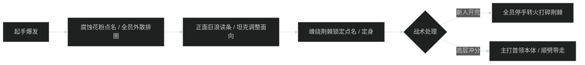
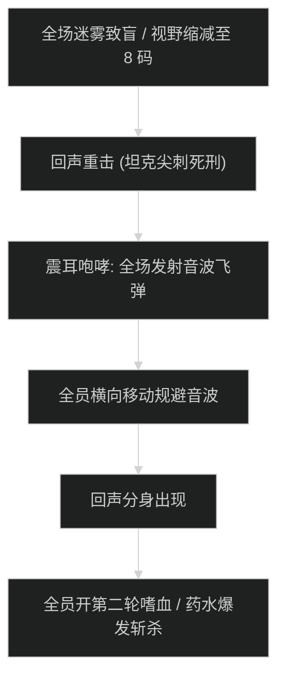

# 夺目谷 (The Blinding Vale) 首领机制与击杀指南

## 1. 1 号首领：郁林守护者瓦伦 (Gloomtender Valen)

### 机制时序图

### 核心机制应对
- **腐蚀花粉 (Corrosive Pollen)**：
  - 随机点名 2 名队员，脚下生成 5 秒递增的毒雾圈，倒计时结束在地面留下永久腐蚀毒水。
  - **新人解法**：被点名者立刻贴近场地边缘排火，严禁将毒水排在近战位或正中央。
- **巨木之怒 (Wrath of the Timber)**：
  - 坦克死刑重击，附加 100% 易伤。坦克必须覆盖核心硬减伤（如盾击+炽热防御者，或吸血鬼之血）。
- **缠绕荆棘 (Grasping Briars)**：
  - 限制被点名者移动，并造成持续自然伤害。近战输出需在首领脚下通过神圣风暴或湮灭顺劈自然带碎。

---

## 2. 2 号首领：荆棘之母布赖尔 (Thornmother Briar)

### 核心技能与灭团点
- **荆棘之雨 (Rain of Thorns)**：
  - 首领引导 6 秒，对全场发射无数尖刺。全团每秒承受 18 万自然伤害，并获得不可驱散的流血效果。
  - **减伤对齐**：治疗必须提前 2 秒铺好群体抬血（如奶骑美德道标+晨光，或奶萨升腾），全队交出个人 20% 以上减伤。
- **爆裂树苗 (Volatile Saplings)**：
  - 首领每 45 秒召唤 4 只快速移动的树苗。树苗触碰首领或被击杀时发生范围自爆。
  - **新人策略**：德鲁伊纠缠根须、萨满地缚图腾或猎人冰冻陷阱将树苗定在原地，拉开距离点杀。
  - **冲分策略**：直接在首领脚下拉紧，利用全团硬无敌（如圣骑无敌、DK绿罩）在树苗靠近时一口气群晕融化，不浪费单点伤害。

---

## 3. 3 号尾王：盲眼之王 (The Blind King)

### 核心技能与极限压阶段

- **回声致盲 (Echoing Blindness)**：
  - 全场视野被压缩至 8 码内，无法看到远端队友。全队必须以坦克为轴心保持紧凑抱团移动，防止治疗脱节。
- **震耳咆哮 (Deafening Roar)**：
  - 施法完成时对全场发射 12 枚扩散的超声波球，触碰即死。
  - **应对动作**：施法读条期间全员必须停止贪刀，横向走位穿过球与球之间的空隙。
- **回声分身与斩杀**：
  - 首领血量降至 30% 时召唤 1 个镜像复制所有技能。冲分队伍在此处开启第 2 轮嗜血与全爆发药水，无视镜像，全力将首领本体压死。
