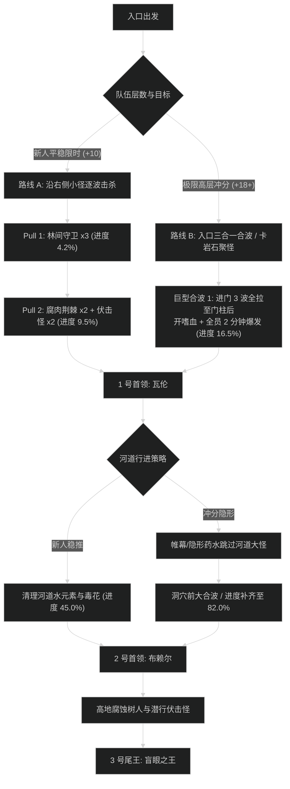

# 夺目谷 (The Blinding Vale) 路线规划与拉怪时序

## 1. 路线决策时序图

---

## 2. 新人平稳推进路线 (+7 至 +12 层)

- **核心原则**：不合波、不强行跳怪；每波怪数量控制在 3-4 只；稳妥清理潜行伏击怪，防止行进中被晕导致灭团。
- **目标进度**：击杀尾王前达到 **101.2%**，防止漏打小怪折返。

### 拉怪波次细节 (Pulls)

1. **Pull 1 (入口)**：林间守卫 x3。平稳聚怪，坦克背对人群拉开，优先打断“荆棘突刺”。进度：4.2%。
2. **Pull 2 (右侧林道)**：腐肉荆棘 x2 + 潜行迷雾行者 x2。照明弹或幽灵视觉显形，打断“剧毒新星”。进度：9.5%。
3. **Pull 3 (1 号门前)**：林间守卫 x2 + 沼泽漫步者 x1。漫步者踩踏时近战后撤，坦克覆盖盾击。进度：16.0%。
4. **1 号首领：瓦伦**。战斗耗时约 2分10秒。击杀后开启捷径门。
5. **Pull 4 - Pull 7 (河道与泥沼)**：逐波清理剧毒幼虫与水元素，必须保证队伍有清毒，逐只清理。进度推进至 52.0%。
6. **2 号首领：布赖尔**。战斗耗时约 2分30秒。
7. **Pull 8 - Pull 12 (洞穴与高台)**：稳步处理洞内致盲小怪，进度推至 101.2%。
8. **3 号尾王：盲眼之王**。平稳击杀，剩余时间约 3分40秒。

---

## 3. 高层冲分极限合波路线 (+18 至 +22+ 层)

- **核心原则**：入口前 3 波直接合拉，利用门侧巨石卡视野聚怪，配合全技能与嗜血融怪；河道利用盗贼帷幕跳过血厚且技能危险的泥沼漫步者；时间压缩目标为 24 分钟以内完成。

### 极限合波批次 (Mega-pulls)

1. **合波 1 (入口至 1 号门外)**：
   - 包含小怪：林间守卫 x5 + 腐肉荆棘 x3 + 潜行怪 x3（共 11 只）。
   - 战术动作：坦克骑马挂仇恨，直奔 1 号门右侧大岩石后方站位，迫使所有远程读条怪聚拢成一团。
   - 技能分配：**起手开嗜血** + 全员 2 分钟大爆发 + 爆发药水；血DK群握聚紧，圣骑士盲目之光覆盖第 1 次全员读条；队伍峰值秒伤需超越 380 万。进度瞬间达到 16.5%。
2. **1 号首领：瓦伦**：全员小爆发压制，首领战斗耗时压进 1分40秒。
3. **跳怪战术 (河道区)**：
   - 使用潜行者【暗影帷幕】或全员饮用【次级隐形药水】，贴右侧水域直接绕过 2 只沼泽巨兽（节省约 1分15秒纯单体打木桩时间）。
4. **合波 2 (2 号洞穴前平台)**：
   - 包含小怪：剧毒幼虫群（12只）+ 洞穴守门暴怒树人 x2。
   - 战术动作：幼虫血量极少，但死后自爆叠全队毒性，利用萨莱茵血兽引爆或武器战剑刃风暴瞬间融化，治疗开启全团大免伤（如无敌道标、大罩）硬吃自爆毒素。进度达到 82.0%。
5. **2 号首领：布赖尔**：树苗依靠群控（缠绕/地缚）控制在场地外圈，不分心转火，纯打本体压缩阶段。耗时约 1分50秒。
6. **合波 3 (尾王门前廊道)**：合拉最后两波致盲信徒，打断群盲，进度达到 100.0%。
7. **3 号尾王：盲眼之王**：第二次嗜血转好，全力嗜血斩杀。总耗时锁定在 24分30秒至 25分10秒（+20 层大幅领先限时）。
