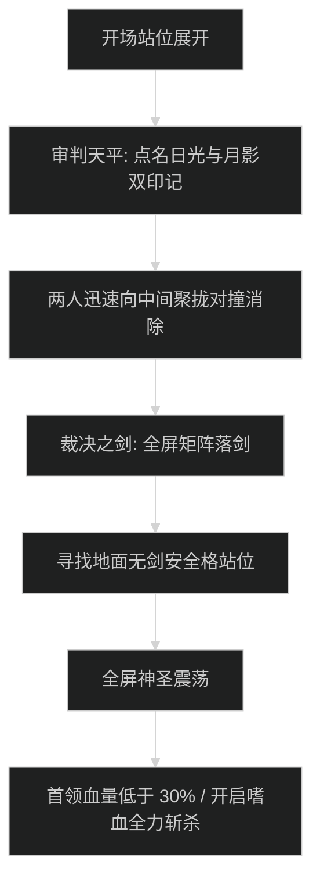

# 晨曦尖塔 (The Dawnspire) 首领机制与击杀指南

## 1. 1 号首领：日曜守卫索伦 (Solar Guardian Solenn)

### 机制流程图

- **日光充能 (Solar Overcharge)**：首领能量满 100 引导全场神圣风暴，持续 8 秒全团大掉血。全员开启个人减伤，治疗交核心群抬。
- **灼热重击 (Searing Slam)**：坦克神圣死刑，必须开启【远古列王守卫】或【绿罩+灵界打击】。

---

## 2. 2 号首领：烈阳执政官 (Archon of the Sun)

### 核心机制与旋转激光走位
- **晨曦射线 (Dawnlight Ray)**：
  - 首领跃至场地中央，射出 4 道连通边缘的高能光束，并沿顺时针匀速旋转。
  - **应对**：全员跟随旋转方向贴近内圈蛇形小步走位，严禁贪刀跨越光束（触碰即造成 200 万秒杀神圣伤害）。
- **纯净护盾 (Purifying Ward)**：
  - 激光阶段结束首领获得吸收盾，全队集火击破。

---

## 3. 3 号尾王：高阶裁决者奥蕾莉亚 (High Arbiter Aurelia)

### 审判天平印记与破狂暴时序

- **审判天平 (Scales of Judgment)**：
  - 随机点名 2 名队员：1 名获得【日曜印记】，1 名获得【月影印记】。倒计时 6 秒内两人必须在场中相互碰撞触发抵消，若未碰撞则倒计时结束引发全团秒杀。
- **裁决之剑矩阵 (Sword of Judgment Matrix)**：
  - 场上划分棋盘格，大剑自天顶连续轰炸，全队必须看清发光安全区迅速位移。
- **斩杀阶段**：
  - 30% 血量以下落剑频次加倍，全队开第二轮嗜血斩杀。
