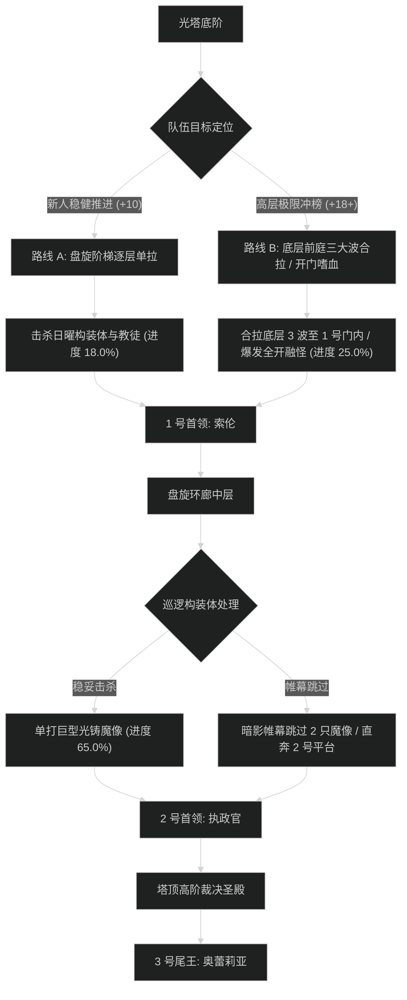

# 晨曦尖塔 (The Dawnspire) 路线规划与拉怪时序

## 1. 路线决策时序图

---

## 2. 新人平稳推进路线 (+7 至 +12 层)

- **核心原则**：不合拉构装体；烈阳祭司读条【圣光祷言】必须优先集火打断；稳步清怪。
- **目标进度**：击杀尾王前达到 **101.2%**。

### 拉怪波次细节 (Pulls)
1. **Pull 1 (底阶前庭)**：日曜构装体 x1 + 炽热狂热者 x3。击退走开，狂热者自爆注意后撤。进度：5.5%。
2. **Pull 2 (迎光阶梯)**：烈阳祭司 x1 + 构装体 x1。打断圣光祷言。进度：11.5%。
3. **Pull 3 (1 号门外)**：烈阳祭司 x2 + 狂热者 x4。双打断分配，全员开小减伤。进度：18.5%。
4. **1 号首领：索伦**。日光充能时全员开减伤，耗时约 2分20秒。
5. **Pull 4 - Pull 8 (中层环廊)**：逐波清理光铸魔像与教徒，进度推进至 66.0%。
6. **2 号首领：烈阳执政官**。顺时针跑激光，耗时约 2分40秒。
7. **Pull 9 - Pull 12 (塔顶圣坛)**：清理高阶裁决者信徒，进度达到 101.2%。
8. **3 号尾王：奥蕾莉亚**。天平对撞消除印记，耗时约 3分10秒。

---

## 3. 高层冲分极限合波路线 (+18 至 +22+ 层)

- **核心原则**：开门把底层前庭 3 波全部拉进 1 号门内卡视野聚怪，开嗜血直接打穿；中层利用帷幕跳过 2 只高血量光铸魔像；节省 3 分钟以上给塔顶裁决天平阶段。

### 极限合波批次 (Mega-pulls)
1. **合波 1 (底层大聚怪)**：
   - 包含小怪：日曜构装体 x2 + 烈阳祭司 x3 + 狂热者 x8（共 13 只）。
   - 战术动作：坦克聚怪于 1 号门内侧大柱后，**起手直接交嗜血**；萨满电能图腾配合圣骑盲目之光打断全部祭司起手读条。团队秒伤突破 410 万，进度达到 25.0%。
2. **1 号首领：索伦**：纯单体压制，首领战斗时间控制在 1分40秒以内。
3. **跳怪战术 (中层回廊)**：
   - 潜行者【暗影帷幕】穿过，绕过 2 只血厚单体光铸魔像（节省 1分50秒）。
4. **合波 2 (2 号门前平台)**：
   - 合拉两波狂热者与祭司，全员开群晕秒杀，进度推进至 76.0%。
5. **2 号首领：执政官**：破盾阶段全员开爆发药水，激光出现前直接将护盾打碎中断机制，耗时 1分55秒。
6. **合波 3 (塔顶通道)**：拉完剩余信徒，进度精准达到 100.0%。
7. **3 号尾王：奥蕾莉亚**：第二轮嗜血转好，印记对撞后全员开启嗜血与爆发斩杀，耗时 2分30秒。
