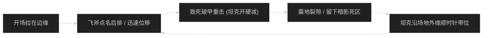
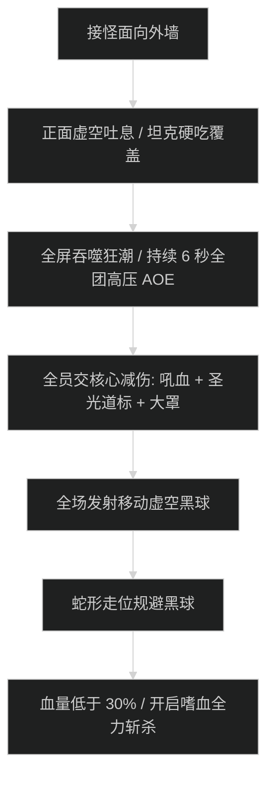

# 虚空之痕竞技场 (Voidscar Arena) 首领机制与击杀指南

## 1. 1 号首领：角斗坑冠军 (The Pit Champion)

### 机制流程图

### 核心机制应对
- **狂怒投掷 (Furious Throw)**：
  - 首领随机对最远距离队员投掷飞斧，落地后持续旋转造成大范围物理伤害。远程队员沿边缘站位，被点名后向前跑位带开飞斧。
- **震地裂隙 (Ground Rift)**：
  - 坦克必须紧贴外墙顺时针带位，留出中央开阔区域供远程走位。

---

## 2. 2 号首领：裂隙编织者卡伦 (Riftbinder Karen)

### 核心技能与引力处理
- **虚空引力场 (Void Gravity Well)**：
  - 场地中央召唤巨型黑洞，持续将全员向中心拉扯，越接近中心受到伤害越高。
  - **应对**：全员开启加速技能向外圈对抗拉力；骑士可交【自由祝福】免疫部分减速。
- **虚空畸体召唤 (Spawn Aberration)**：
  - 每次黑洞结束刷新 2 只虚空畸体，读条【虚空湮灭】。全队必须迅速转火或群晕，严禁漏断。

---

## 3. 3 号尾王：吞虚巨兽 (Void-Gorged Behemoth)

### 核心循环与斩杀时序

- **正面虚空吐息 (Void Breath)**：
  - 绝对不可面向人群，坦克硬吃并覆盖主动大免伤。
- **吞噬狂潮 (Gorging Tide)**：
  - 史诗级高压 AOE，全团每秒受到 22 万暗影伤害。治疗必须交出核心爆发大招，DPS 开启个人减伤。
- **狂暴阶段斩杀**：
  - 30% 血量以下场面黑球极多，全队开嗜血站桩强压首领，在场地完全崩溃前将其斩杀。
