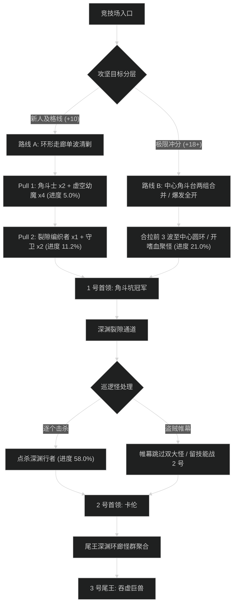

# 虚空之痕竞技场 (Voidscar Arena) 路线规划与拉怪时序

## 1. 路线决策时序图

---

## 2. 新人平稳推进路线 (+7 至 +12 层)

- **核心原则**：不跨阶梯合怪；遇到吞噬者眼球优先集火秒杀防止群恐；稳扎稳打。
- **目标进度**：击杀尾王前达到 **101.0%**。

### 拉怪波次细节 (Pulls)
1. **Pull 1 (入口走廊)**：虚空角斗士 x2 + 虚空幼魔 x4。聚怪击杀，幼魔残血自爆注意后撤。进度：5.0%。
2. **Pull 2 (角斗台阶梯)**：裂隙编织者 x1 + 角斗士 x2。必须分配近战盯死编织者读条。进度：11.2%。
3. **Pull 3 (1 号门外)**：深渊守卫 x2 + 吞噬者眼球 x1。眼球读条时单晕强断。进度：17.8%。
4. **1 号首领：角斗坑冠军**。场地贴边放斧子，耗时约 2分15秒。
5. **Pull 4 - Pull 8 (深渊走廊)**：逐波清理裂隙怪与暗影魔，进度推至 62.0%。
6. **2 号首领：裂隙编织者卡伦**。黑洞吸附全员反向跑位，耗时约 2分40秒。
7. **Pull 9 - Pull 12 (王座平台)**：稳步处理平台巡逻怪，进度达到 101.0%。
8. **3 号尾王：吞虚巨兽**。嗜血斩杀，耗时约 3分00秒。

---

## 3. 高层冲分极限合波路线 (+18 至 +22+ 层)

- **核心原则**：开门把整个中心圆台小怪（包含 2 名编织者与 6 只角斗士）合拉；利用血魔之握或平心之环聚拢，全员开嗜血爆发融化；利用跳怪战术跳过走廊大怪；时间压缩至 24 分钟内。

### 极限合波批次 (Mega-pulls)
1. **合波 1 (开门中心大聚怪)**：
   - 包含小怪：裂隙编织者 x2 + 虚空角斗士 x4 + 虚空幼魔 x8（共 14 只）。
   - 战术动作：坦克骑马绕台一圈拉齐，全队集合在 1 号门内侧卡视野。
   - 技能分配：**起手交嗜血** + 全员 2 分钟大招；圣骑盲目之光 + DK群盲打断起手双编织者的虚空箭雨。团队秒伤突破 420 万，进度达到 21.0%。
2. **1 号首领：冠军**：纯单体木桩压制，耗时 1分40秒。
3. **跳怪战术 (深渊裂隙)**：
   - 使用潜行者【暗影帷幕】贴左侧边缘疾跑穿过，跳过 2 只血厚单体深渊行者（节省 1分30秒）。
4. **合波 2 (2 号门前通道)**：
   - 合并两波眼球与深渊守卫，全员交群晕，秒杀眼球。进度推至 78.5%。
5. **2 号首领：卡伦**：小怪刷新时由副伤害顺劈带走，主目标死压本体，耗时 2分00秒。
6. **合波 3 (尾王大平台)**：拉光平台小怪，进度精准卡在 100.0%。
7. **3 号尾王：吞虚巨兽**：第二轮嗜血转好，全力嗜血爆发斩杀，耗时 2分25秒。
