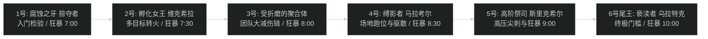

# 团队副本总览与史诗攻坚体系 (Midnight Season 1)

## 1. 团本基础概况

当前基准版本主要团队副本为 **烈毒之渊 (The Venomous Abyss)**，WCL Zone ID 为 `53`。共设 6 位首领，战斗环境以高频全团穿透法术尖刺、流血撕裂与多阶段场地压缩为核心特征。

- **史诗模式人数**：固定 20 人（标准开荒配置：2 坦克 + 4 治疗 + 14 输出；伐木期部分首领压缩为 3 治疗）。
- **通关总装等门槛**：全团平均装等建议达到 630+，武器与核心饰品需达到英雄升级上限。
- **狂暴与极限时序**：后置首领（5 号、尾王）要求全团人均输出突破 230k - 240k DPS，任何早期减员将直接导致狂暴灭团。

---

## 2. 首领结构与击杀难度梯度

---

## 3. 首领攻略目录直达

- **团队副本总览**：`instances/raid/the-venomous-abyss/README.md`
- **史诗全首领狂暴线与秒伤门槛横评**：`instances/raid/the-venomous-abyss/benchmarks.md`
- **1 号首领：腐蚀之牙 掠夺者**：`instances/raid/the-venomous-abyss/bosses/01-acidfang.md`
- **2 号首领：孵化女王 维克希拉**：`instances/raid/the-venomous-abyss/bosses/02-vexira.md`
- **3 号首领：受折磨的聚合体**：`instances/raid/the-venomous-abyss/bosses/03-tormented-amalgam.md`
- **4 号首领：缚影者 马拉考尔**：`instances/raid/the-venomous-abyss/bosses/04-malakor.md`
- **5 号首领：高阶祭司 斯里克希尔**：`instances/raid/the-venomous-abyss/bosses/05-srikthir.md`
- **6 号尾王：亵渎者 乌拉特克**：`instances/raid/the-venomous-abyss/bosses/06-ulatek.md`
