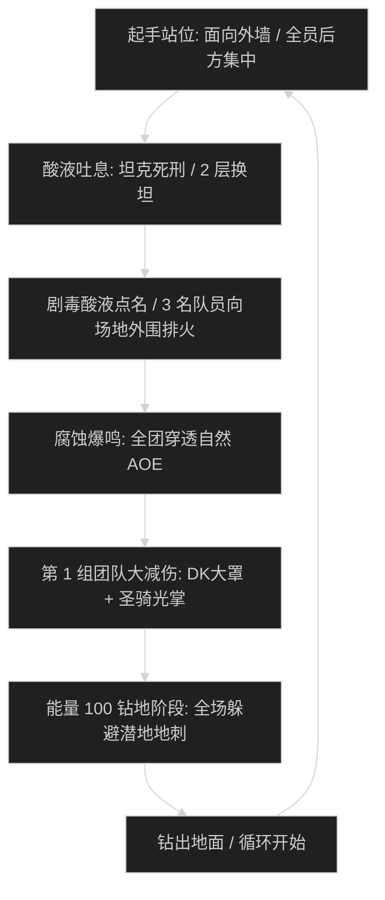

# 腐蚀之牙 掠夺者 (Acidfang the Ravager) 史诗攻坚指南

## 1. 战斗流程与时序图

---

## 2. 核心技能与应对机制

- **酸液吐息 (Acidic Breath)**：
  - 首领对当前目标施放前方 60 度扇形酸液喷吐，造成 180 万物理与自然混合伤害，并附加持续 20 秒的 100% 易伤。2 层必须换坦，副坦秒嘲。
- **剧毒酸池点名 (Toxic Pools)**：
  - 随机点名 3 名远程与治疗队员，5 秒后在脚下生成永久剧毒酸池。被点名者必须立刻向边缘指定标记点移动，沿顺时针紧密贴放。
- **腐蚀爆鸣 (Corrosive Detonation)**：
  - 首领每 60 秒施放一次全屏高压 AOE，全团承受 260 万/秒瞬时承伤峰值。必须严格按时间轴分配大减伤。

---

## 3. 职责分工表

| 职责 | 核心行动要点 | 关键自保与灭团预警 |
| :--- | :--- | :--- |
| **坦克 (Tank)** | 始终保持首领面向场地外围，严禁朝向人群；吐息 2 层立即换坦；钻地阶段迅速接住现身仇恨。 | 裸吃吐息直接暴毙；换坦慢 1 秒导致倒主坦。 |
| **治疗 (Healer)** | 爆鸣读条前 3 秒铺好回血；重点看护中排酸液队员血线；协助驱散中点名的减速效果。 | 预留单抬大招（圣疗术、回响静滞）应对走位延迟队员。 |
| **输出 (DPS)** | 严格在外圈规避排火路线；钻地阶段集中火力击碎现身甲壳；嗜血起手爆发全开。 | 严禁贪刀将酸池排在近战位导致场地压缩减员。 |

---

## 4. 新人开荒 SOP vs 伐木冲分打法

- **新人开荒策略**：采用 4 治疗配置；全员排火严格贴墙；钻地阶段停止贪刀，全力专注走位躲地刺；嗜血起手交。
- **伐木冲分打法**：压缩为 3 治疗，全员偷爆发药水起手交嗜血，在首领第一次钻地前将其压进 50% 血量，跳过第二次钻地直接斩杀。
