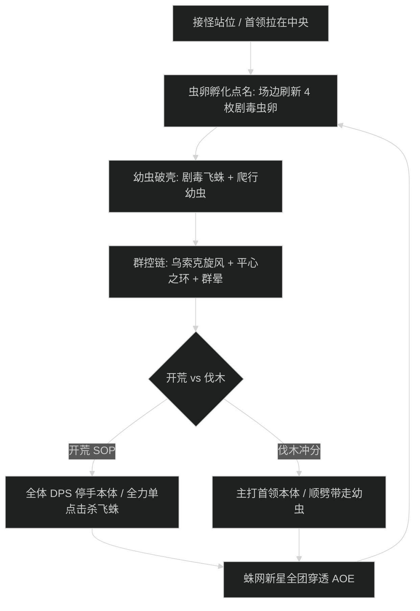

# 孵化女王 维克希拉 (Broodmother Vexira) 史诗攻坚指南

## 1. 战斗流程与时序图

---

## 2. 核心技能与应对机制

- **虫卵孵化 (Brood Incubation)**：
  - 场地四角每 75 秒刷新 4 枚巨型虫卵，孵化出两只【剧毒飞蛛】与大量【爬行幼虫】。飞蛛读条【神经麻痹毒素】，必须由远程盯死打断。
- **蛛网新星 (Web Nova)**：
  - 首领拉拽全团至脚下并引导 4 秒全屏新星，造成 290 万承伤峰值。全员被拉后必须立即反向交位移（如闪现、猎人后跳、法阵）撤出 15 码外圈。
- **穿刺剧毒爪 (Piercing Toxic Claws)**：
  - 坦克死刑连击，造成 2 次连续物理与自然重击，3 层换坦。

---

## 3. 职责分工表

| 职责 | 核心行动要点 | 关键自保与灭团预警 |
| :--- | :--- | :--- |
| **坦克 (Tank)** | 副坦负责快速聚拢幼虫，拉在首领侧面；死刑爪击读条时覆盖主动硬减；3 层迅速交接。 | 幼虫走散扑杀后排治疗；蛛网新星未及时位移倒坦。 |
| **治疗 (Healer)** | 蛛网新星拉拽前 2 秒交出全团减伤（大罩/吼血）；关注被剧毒飞蛛点名咬中的队员单体血线。 | 严禁被拉拽后原地读条，必须先位移再抬血。 |
| **输出 (DPS)** | 飞蛛刷新后远程立即打断读条；近战职业在首领身边通过顺劈技能处理爬行幼虫。 | 飞蛛读条未断导致治疗全团麻痹灭团。 |

---

## 4. 新人开荒 SOP vs 伐木冲分打法

- **新人开荒策略**：全员以清理小怪为第一优先级，指定 2 名专职远程打断飞蛛；嗜血开在第三波小怪与首领本体双重压力的 4 分钟节点。
- **伐木冲分打法**：采用恶魔术与武器战为主的顺劈阵容，主目标死压首领本体，依靠顺劈直接融化幼虫；起手开嗜血强杀，将战斗时间压缩至 5 分钟以内。
