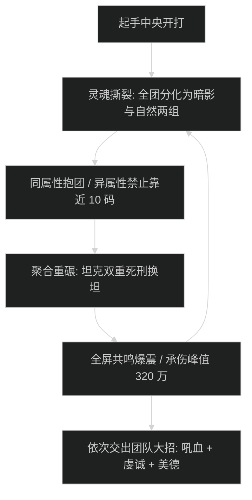

# 受折磨的聚合体 (Tormented Amalgam) 史诗攻坚指南

## 1. 战斗流程与时序图

---

## 2. 核心技能与应对机制

- **双重属性撕裂 (Dual Torment Rend)**：
  - 首领每 90 秒将全团均分为【暗影受难者】与【自然受难者】两组，头顶分别显现黑白标记。
  - **核心操作**：相同属性队员必须迅速集合抱团分摊伤害；异属性队员之间若距离小于 10 码，立即触发【湮灭共鸣】秒杀周围所有人。
- **聚合重碾 (Amalgam Crush)**：
  - 坦克死刑重击，同时造成物理与法术巨额直伤，换坦必须在读条结束瞬间完成。
- **共鸣爆震 (Resonance Burst)**：
  - 全屏高压尖刺 AOE，全团承受 320 万/秒瞬时承伤峰值。必须按秒严格交出减伤链。

---

## 3. 职责分工表

| 职责 | 核心行动要点 | 关键自保与灭团预警 |
| :--- | :--- | :--- |
| **坦克 (Tank)** | 暗影组与自然组坦克分别拉在左右两半场，严禁两名坦克靠近；死刑必须覆盖核心大减伤。 | 坦克重叠引发团灭；换坦慢 1 秒导致倒坦。 |
| **治疗 (Healer)** | 治疗按属性分工：2 治疗主看左侧暗影组，2 治疗主看右侧自然组；爆震来临前提前预铺。 | 严禁跨场跑动刷血导致属性碰撞炸团。 |
| **输出 (DPS)** | 属性变换瞬间立即停止输出 1 秒，看清头顶标记归队；归位后再开启爆发。 | 贪刀穿过中场导致全团湮灭秒杀。 |

---

## 4. 新人开荒 SOP vs 伐木冲分打法

- **新人开荒策略**：在中场设立清晰光柱标记（蓝光柱自然、紫光柱暗影）；转阶段全员优先走位归队，宁可损失 2 个 GCD 也不许抢输出；嗜血开在狂暴前的最后一次爆震。
- **伐木冲分打法**：全员近战贴首领脚下分成左右微距站位，保持 10.5 码极限距离无损输出；起手直接交嗜血压制首领血量。
