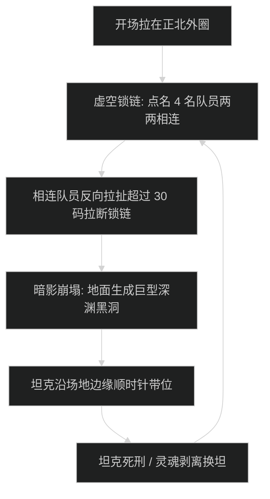

# 缚影者 马拉考尔 (Shadowbinder Malakor) 史诗攻坚指南

## 1. 战斗流程与时序图

---

## 2. 核心技能与应对机制

- **虚空锁链 (Shadow Chains)**：
  - 首领随机连结两对队员（共 4 人）。连线存在期间每秒受到 15 万暗影伤害，且两人移动速度降低 30%。
  - **解法**：两名队员必须开启加速技能（疾跑/咆哮/位移）反向跑动，拉开距离超过 30 码方可扯断锁链。拉断瞬间全团受到 40 万物理震荡伤害。
- **暗影崩塌 (Void Collapse)**：
  - 场地出现大面积暗影死区，永久存在不可消除。场地极为有限，坦克必须极其紧凑地沿边缘带位。
- **灵魂剥离 (Soul Cleave)**：
  - 坦克死刑技能，击飞当前坦克并剥离出灵魂幻象，副坦必须在击飞瞬间嘲讽接手首领。

---

## 3. 职责分工表

| 职责 | 核心行动要点 | 关键自保与灭团预警 |
| :--- | :--- | :--- |
| **坦克 (Tank)** | 死刑击飞前背靠场地边缘，严禁被击飞落入深渊死区；副坦秒嘲接怪；带位必须贴紧已有的黑洞边缘，节约场地。 | 坦克被击飞坠亡；带位过快导致场地提前被黑洞占满。 |
| **治疗 (Healer)** | 锁链扯断瞬间全团有集中掉血，提前刷满全员血线；关注拉扯锁链队员的单体抬血。 | 锁链扯断频次过快导致全团震荡重叠灭团。 |
| **输出 (DPS)** | 中锁链者必须立刻反向走位扯断，严禁原地站桩读条；规避暗影崩塌黑圈。 | 贪刀不拉断锁链导致持续掉血跳死。 |

---

## 4. 新人开荒 SOP vs 伐木冲分打法

- **新人开荒策略**：锁链扯断需有节奏地依次拉断，第一对拉断后间隔 2 秒再拉断第二对，防止全团承伤重叠峰值过高倒人；嗜血开在狂暴前 1 分钟。
- **伐木冲分打法**：全员中锁链直接交大招与无敌同时扯断，治疗交全屏大罩硬刷；起手嗜血全开，在全场黑洞铺满 60% 之前强杀首领。
