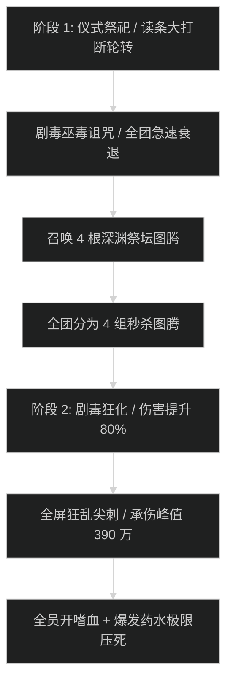

# 高阶祭司 斯里克希尔 (High Priestess Srik'thir) 史诗攻坚指南

## 1. 战斗流程与时序图

---

## 2. 核心技能与应对机制

- **剧毒巫毒诅咒 (Toxic Voodoo Curse)**：
  - 随机对半数团队施加诅咒，降低施法速度 50% 并造成极高自然伤害。萨满、德鲁伊与法师必须以最快速度驱散。
- **深渊祭坛图腾 (Abyssal Altars)**：
  - 场地四角刷新 4 根高血量图腾，引导期间首领免疫一切伤害并全团持续 AOE。全队必须严格划分为 4 支小分队（每组 1 坦/3-4 输出）同步击破。
- **阶段 2 剧毒狂化 (Toxic Frenzy)**：
  - 首领血量降至 35% 后进入绝对狂暴，平砍与技能伤害提升 80%，全团治疗缺口激增至 155 万/秒。

---

## 3. 职责分工表

| 职责 | 核心行动要点 | 关键自保与灭团预警 |
| :--- | :--- | :--- |
| **坦克 (Tank)** | 死刑技能【穿心毒刃】必须覆盖盾壁/符文刃舞；转阶段分头去拉住四角图腾守卫。 | 漏开减伤被毒刃直接秒杀；图腾守卫打后排减员。 |
| **治疗 (Healer)** | 狂化阶段治疗缺口极大，4 治疗必须按秒衔接大招（如赞美诗、美德道标、宁静、升腾）。 | 法力耗尽导致狂暴阶段全员空血灭团。 |
| **输出 (DPS)** | 4 组图腾击破时间差严禁超过 3 秒（单根图腾先爆会强化其余图腾）；狂化期交全爆发斩杀。 | 贪打本体导致图腾超时引导炸团。 |

---

## 4. 新人开荒 SOP vs 伐木冲分打法

- **新人开荒策略**：图腾分配标明负责人，精确到人；转阶段全员专注图腾击杀；嗜血必须留在 35% 狂化阶段配合团队防暴毙减伤使用。
- **伐木冲分打法**：通过恶魔术、平衡德长线多目标顺劈压制图腾，起手偷嗜血直接打压首领血线，将首领战斗耗时压制在 7 分钟以内。
